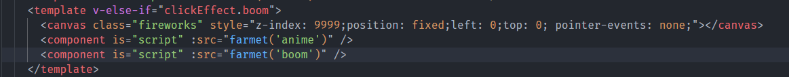
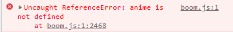
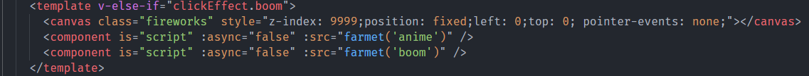

---

# 默认为文件名称
title: 

tags:

# 类别中已包含文件夹名称
categories:

description: 当动态插入多条script的时候,有依赖关系的script并没有按照顺序执行

# 该字段必须,格式 <YYYY-MM-DD hh:mm:ss>
publishTime: 2022-09-02 17:01:50
updateTime:
 
# 默认随机
img: 

# 目录
toc: false

# 评论
comment: true
---

### bug 描述

当动态插入多条script的时候,有依赖关系的script并没有按照顺序执行：

### bug 原因

动态插入到dom中的script默认采用 `async`的加载方式，**并行下载，谁先下载完谁就先执行**，因此，当下载的速度不一致时，就会导致执行顺序紊乱，后面的script的依赖可能还不存在，因此报错，而且这种报错还不稳定，比较的是下载的速度。

### bug 解决

取消 async 的加载方式，恢复顺序执行。

即是：设置`async:false`

