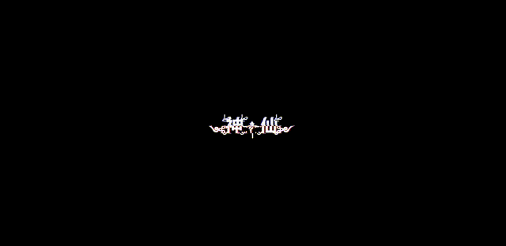

---

# 默认为文件名称
title: 

tags:
  - 美化

# 类别中已包含文件夹名称
categories:

description: 故障风效果实现，可以用于文字Logo

# 该字段必须,格式 <YYYY-MM-DD hh:mm:ss>
publishTime: 2022-08-13 01:46:05
updateTime:
 
# 默认随机
img: 

# 目录
toc: true

---

## 效果



👉[点击这里可预览](/resources/Fault_wind_text/index.html)

## 实现

html 结构：

```html
<div class="fault-wind" date-text="༺ۣۖ神ۣۖ༒ۣ仙ۣۖ༻">
        ༺ۣۖ神ۣۖ༒ۣ仙ۣۖ༻
</div>
```

css 实现：

```css
/* clip-path: insert(*,*,*,*) 四个方向上往内裁剪  */
@keyframes animation-before{
    0% {
        clip-path: inset(0 0 0 0);
    }
    5% {
        clip-path: inset(.8em 0 .4em 0);
    }
    10% {
        clip-path: inset(.4em 0 .8em 0);
    }
    15% {
        clip-path: inset(.1em 0 1em 0);
    }
    20% {
        clip-path: inset(.3em 0 .6em 0);
    }
    25% {
        clip-path: inset(.8em 0 .5em 0);
    }
    30% {
        clip-path: inset(.5em 0 .8em 0);
    }
    35% {
        clip-path: inset(1em 0 .1em 0);
    }
    40% {
        clip-path: inset(.7em 0 .35em 0);
    }
    45% {
        clip-path: inset(.5em 0 .2em 0);
    }
    50% {
        clip-path: inset(.2em 0 .5em 0);
    }
    55% {
        clip-path: inset(.35em 0 .7em 0);
    }
    60% {
        clip-path: inset(.1em 0 .9em 0);
    }
    65% {
        clip-path: inset(.8em 0 .46em 0);
    }
    70% {
        clip-path: inset(.66em 0 .33em 0);
    }
    75% {
        clip-path: inset(.48em 0 .23em 0);
    }
    80% {
        clip-path: inset(.23em 0 .48em 0);
    }
    85% {
        clip-path: inset(.39em 0 .79em 0);
    }
    90% {
        clip-path: inset(.33em 0 .66em 0);
    }
    95% {
        clip-path: inset(1em 0 .3em 0);
    }
    100% {
        clip-path: inset(.62em 0 .29em 0);
    }
}

@keyframes animation-after {
    0% {
        clip-path: inset(0 0 0 0);
    }
    5% {
        clip-path: inset(.4em 0 .8em 0);
    }
    10% {
        clip-path: inset(.8em 0 .4em 0);
    }
    15% {
        clip-path: inset(1em 0 .1em 0);
    }
    20% {
        clip-path: inset(.6em 0 .3em 0);
    }
    25% {
        clip-path: inset(.5em 0 .8em 0);
    }
    30% {
        clip-path: inset(.8em 0 .5em 0);
    }
    35% {
        clip-path: inset(.1em 0 1em 0);
    }
    40% {
        clip-path: inset(.35em 0 .7em 0);
    }
    45% {
        clip-path: inset(.2em 0 .5em 0);
    }
    50% {
        clip-path: inset(.5em 0 .2em 0);
    }
    55% {
        clip-path: inset(.7em 0 .35em 0);
    }
    60% {
        clip-path: inset(.9em 0 .1em 0);
    }
    65% {
        clip-path: inset(.46em 0 .8em 0);
    }
    70% {
        clip-path: inset(.33em 0 .66em 0);
    }
    75% {
        clip-path: inset(.23em 0 .48em 0);
    }
    80% {
        clip-path: inset(.48em 0 .23em 0);
    }
    85% {
        clip-path: inset(.79em 0 .39em 0);
    }
    90% {
        clip-path: inset(.66em 0 .33em 0);
    }
    95% {
        clip-path: inset(.3em 0 1em 0);
    }
    100% {
        clip-path: inset(.29em 0 .62em 0);
    }
}

.fault-wind{
    display: inline-block;
    font-size: 65px;
    font-weight: 600;
    padding: 0 4px;
    color: white;
    position: relative;
    user-select:none;
    -ms-user-select:none;
    -moz-user-select:none;
    -khtml-user-select:none;
    -khtml-user-select:none;
    -webkit-touch-callout:none;
}
.fault-wind::before{
    content: attr(date-text);
    position: absolute;
    left: -2px;
    width: 100%;
    background-color: black;
    text-shadow: 2px 0 red;
    animation: animation-before 3s infinite linear alternate-reverse;
}

.fault-wind::after{
    content: attr(date-text);
    position: absolute;
    left: 2px;
    width: 100%;
    background-color: black;
    text-shadow: -2px 0 blue;
    animation: animation-after 3s infinite linear alternate-reverse;
}
```


## 下载 demo

👉[点击这里](/resources/Fault_wind_text/Fault_wind_text.rar)
