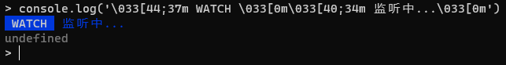

---

# 默认为文件名称
title: 

tags:
  - console
  - 美化

# 类别中已包含文件夹名称
categories:

description: console 除了 log() 外，不仅可以拥有美丽的样式，还有更多的高级用法。

# 该字段必须,格式 <YYYY-MM-DD hh:mm:ss>
publishTime: 2022-08-12 16:47:06
updateTime: 2022-08-14 20:35:05
 
# 默认随机
img: 

# 目录
toc: true

---

# console 高级用法

## 方法

**我可能用上的一些函数方法**

### assert

```js
console.assert(assertion, obj1 [, obj2, ..., objN]);
```

`assertion` 是一个布尔表达式。如果为真，此语句将被忽略；如果为假，将会导致一个`AssertionError`被抛出，并输出后面传入的内容，但是并不会中断代码的执行。


调试时用于确定是否得到自己想要的的中间结果

### clear

觉得页面加载完成后控制台太乱了可以用它来**清除控制台信息**

### count | countReset

```js
console.count([label]);
console.countReset([label]);
```

其中 label 为 string 类型，默认为 `default`。对每一个不同的 label 计数是互异的


调试时如果对循环运行的代码不知道运行了多少次可以使用该方法

`countReset`重置计数

### error | warn

打印**错误**|**警告**信息，只在浏览器中适用，在node中无效

### group |  groupCollapsed | groupEnd

```js
console.group("组名")
// 其他打印信息
console.groupEnd()
```

group 和 groupCollapsed 都用于创建一个可折叠的分组，之后的所有打印都包含在这个分组中，直到运用 groupEnd 结束分组

group 默认是展开的分组，groupCollapsed 默认不展开


用于整理打印信息，分功能或组件显示调试信息

### table

将数据以表格的形式显示

```js
console.table(data [, columns])
```

`data` 是一个数组或者对象，`columns` 是展示的列表，默认是展示所有列

表格的第一列是`index`索引，如果 data 是数组，index 为数组索引项；如果 data 是对象，index 为各对象属性名称

如果 data 为对象数组，则 index 为数组索引，各个对象的属性值的并集构成列属性集合，这时可使用 columns 来定义需要展示的列


### time | timeLog | timeEnd

用于监控某一操作或功能块运行完成所花费的时间，还可以打印一连串任务执行过程中具体每个任务所花费的时间

```js
console.time(timerName) // 开启计时器
console.timeLog(timerName) // 打印中间时刻
console.timeEnd(timerName) // 计数器结束，输出总时间
// -> timerName: ... ms
```

tiemrName 默认为 `default`

### trace

用于调试代码的调用路径


## 样式

可以为控制台添加自定义的样式，美化控制台输出

### 浏览器控制台

可以使用 `%c` 为打印内容定义样式：

```js
console.log("%cabab", "color: yellow;background:red");
```

效果如下：


注意： 样式只影响 %c 之后的内容

支持的属性包括：


### node 命令行

使用 `\033` 与 `\033[0m` 字符组包括的内容将采用 `[ A;Bm`  所规定的样式

其中： 

- `\033` ： 标识着样式的开始或结尾
-  `[0m` ：表示关闭前面采用的样式属性
-  `A` ：表示**背景色**(40黑，41红，42绿，43黄，44蓝，45紫，46深绿，47白色)
-  `B` ：表示**文字色**(30黑，31红，32绿，33黄，34蓝，35紫，36深绿，37白色)

例如：

```js
console.log('\033[44;37m WATCH \033[0m\033[40;34m 监听中...\033[0m')
```

效果如下：



注意：该种方式**在浏览器中同样生效**


