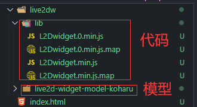

---

# 默认为文件名称
title: 

tags:
  - 美化

# 类别中已包含文件夹名称
categories:

description: 配置添加看板娘，操作简单

# 该字段必须,格式 <YYYY-MM-DD hh:mm:ss>
publishTime: 2022-08-13 22:54:30
updateTime:
 
# 默认随机
img: 

# 目录
toc: true

---

## 效果


👉[点击预览](/resources/live2dw/index.html)

这个看板娘是本人最喜欢的一种，简洁可爱，名叫 `koharu`，只提供该模型下载，更多的可以自行百度下载

## 实现



代码：

```html
<head>
    <!-- head中引入 -->
    <!-- 会向全局暴露 L2Dwidget 对象 -->
    <script src="./live2dw/lib/L2Dwidget.min.js"></script>
</head>
```

注意：`L2Dwidget 对象必须首先加载`

```js
<body>
    <script type="text/javascript">
    	window.L2Dwidget.init({
            	// 根路径
      		pluginRootPath: './live2dw/',
            	// 在根路径下的代码路径 
      		pluginJsPath: 'lib/',
            	// 在根路径下的模型路径
      		pluginModelPath: `live2d-widget-model-koharu/assets/`,
      		tagMode: false,
      		debug: false,
      		model: {
                	// 模型中的model.json路径
        		jsonPath: `./live2dw/live2d-widget-model-koharu/assets/koharu.model.json`,
      		},
      		display: {
                	// 位置配置
        		position: 'left',
        		width: 100,
        		height: 200
      		},
      		mobile: {
                	// 移动端不显示
        		show: false
      		},
      		log: false,
      		react: {
                	// 样式配置
        		opacity: 0.7
      		}
    	})
    </script>
</body>
```

## 下载 demo

👉[点击这里](/resources/live2dw/live2dw.rar)


