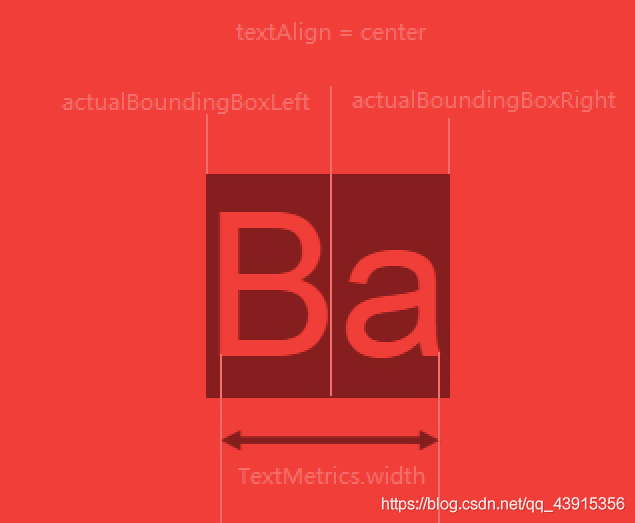
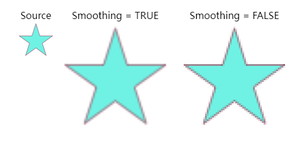
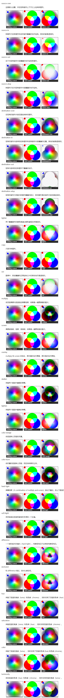

---

# 默认为文件名称
title: 

tags:

# 类别中已包含文件夹名称
categories:

description: js 强大的画布 canvas，绘制出精美的图形！

# 该字段必须,格式 <YYYY-MM-DD hh:mm:ss>
publishTime: 2022-10-01 00:36:45
updateTime:
 
# 默认随机
img: 

# 目录
toc: true

# 评论
comment: true

# 发布
publish: true

---

# Canvas

## 基本使用

### canvas 元素

Canvas API 提供了一个通过JavaScript 和 HTML的`<canvas>`元素来绘制图形的方式。它可以用于动画、游戏画面、数据可视化、图片编辑以及实时视频处理等方面。

Canvas API 主要聚焦于 **2D 图形**。而同样使用`<canvas>`元素的 WebGL API 则用于绘制硬件加速的 2D 和 3D 图形。

HTML 中：

```html
<canvas id="my_canvas" width="300" height="150"></canvas>
```

`width`：canvas 长度，默认 300px

`height`：canvas 宽度，默认 150px

**注意：canvas 也可以使用 Css 来设置它的长宽，但是如果 Css 设置的长宽与 canvas 标签中的长宽不一致时，实质上是将 canvas 拉伸到指定宽高，可能会出现失真、扭曲等现象，所以尽量在 canvas 标签中指定。**

如果想让 canvas 自适应屏幕大小，例如满屏，可以通过监听窗口大小实现：

```js
/**
 * @type {HTMLCanvasElement}
 */
const canvas = document.getElementById("my_canvas")

const setCanvasSize = () => {
  canvas.setAttribute("width", window.innerWidth)
  canvas.setAttribute("height", window.innerHeight)
}

setCanvasSize()
// 借助防抖函数，避免过频繁触发，只触发最后一次
const debounceResize = debounce(setCanvasSize, 100)
window.addEventListener("resize", debounceResize)
```

注意：

1. 替换内容：并不是所有浏览器都支持 canvas ，但可以兜底内容来替换它，当不支持时 canvas 会被忽略，相反，支持时内部内容会被忽略

```html
<canvas id="clock" width="150" height="150">
  
</canvas>
```

2. `</canvas>` 不可以省略：canvas 不是单标签元素，否则，文档的剩余所有部分都会被认定为替换内容

### 渲染上下文

`<canvas>` 元素创造了一个固定大小的画布，它公开了一个或多个渲染上下文，其可以用来绘制和处理要展示的内容。我们将会将注意力放在 2D 渲染上下文中。

```js
const canvas = document.getElementById('my_canvas')
const ctx = canvas.getContext('2d')
```

## 绘制形状

### 栅格


- 网格中的一个单元相当于 canvas 的一个像素
- 起点是左上角为 (0,0)
- x 坐标向右为正，y 坐标向下为正

### 绘制矩形

`fillRect(x, y, width, height)`：绘制填充的矩形

`strokeRect(x, y, width, hright)`：绘制矩形边框

`clearRect(x, y, width, height)`：清楚矩形区域，让清除部分完全透明

`rect(x, y, width, height)`：与上方不同的是，该方法会将矩形添加到当前路径中

### 绘制路径

`beginPath()`：新建一条路径，生成之后，图形绘制命令被指向到路径上生成路径。路径是由很多子路径构成，这些子路径都是在一个列表中，所有的子路径（线、弧形、等等）构成图形。而每次这个方法调用之后，列表清空重置，然后我们就可以重新绘制新的图形。

`closePath()`：闭合路径之后图形绘制命令又重新指向到上下文中。closePath 不是必须的，这个方法会通过绘制一条从当前点到开始点的直线来闭合图形。如果图形是已经闭合了的，即当前点为开始点，该函数什么也不做。

以上两个命令过程中绘制的图形被认为是一个路径

### 填充与描边

`fill()`：通过填充路径的内容区域生成实心的图形。调用 fill() 函数时，所有没有闭合的形状都会自动闭合，所以不需要调用 closePath() 函数。

`stroke()`：通过线条来绘制图形轮廓。调用 stroke() 时不会自动闭合。

### 移动笔触

`moveTo(x, y)`：将笔触移动到 (x, y)。当前路径为空，即调用 beginPath() 之后，或者 canvas 刚建的时候，第一条路径构造命令通常都是 moveTo()，总是要在设置路径之后专门指定你的起始位置。

### 绘制直线

`lineTo(x, y)`：从当前点绘制一条直线到 (x, y)

### 绘制圆弧

`arc(x, y, radius, startAngle, endAngle, anticlockwise)`

- radius：半径
- startAngle：开始的角度
- endAngle：结束的角度
- anticlockwise：是否为逆时针，默认为 false，默认顺时针

注意：角度的单位是弧度，`(Math.PI/180) * 角度`

### 贝塞尔曲线

`quadraticCurveTo(cp1x, cp1y, x, y)`：二次贝塞尔曲线，(cp1x, cp1y) 控制点坐标，(x, y) 结束点坐标

`bezierCurveTo(cp1x, cp1y, cp2x, cp2y, x, y)`：三次贝塞尔曲线，(cp1x, cp1y)、(cp2x, cp2y) 两个控制点左边，(x, y) 结束点

### Path2D 对象

Path2D() 会返回一个新初始化的 Path2D 对象（可能将某一个路径作为变量——创建一个它的副本，或者将一个包含 SVG path 数据的字符串作为变量）。

```js
new Path2D();     // 空的 Path 对象
new Path2D(path); // 克隆 Path 对象
new Path2D(d);    // 从 SVG 建立 Path 对象
```

所有的路径方法比如 moveTo, rect, arc 或 quadraticCurveTo 等，如我们前面见过的，都可以在 Path2D 中使用

`addPath(path)`：将另一个 Path2D 对象添加到本对象中

## 添加样式与颜色

`fillStyle = color`：设置填充颜色

`strokeStyle = color`：设置描边颜色

`globalAlpha = transparencyValue`：设置全局透明度，也可以使用 `rgba` 设置单个颜色的透明度


### 线条样式

`lineWidth = value`：设置线条宽度

`lineCap = type`：设置线条末端样式。butt(默认方形，不额外添加)  |  round(圆形)  |  square(方形，与圆形一样，额外添加部分线条宽度的一半)

`lineJoin = type`：设定线条与线条间接合处的样式。miter(默认菱形)  |  bevel(三角形)  |  round(圆弧)

`miterLimit = value`：当 lineJoin = miter 时，当两条线段夹角比较小时，延伸线呈指数增长，设置该值可以限制最大延伸长度，当超过此长度时，转而使用 lineJoin = bevel，默认为 10

`setLineDash(segments)`：segments 为数组，设置虚线的交替长度，实 —> 虚。当 segments 长度为奇数时，会被重复一遍

`getLineDash()`：获取当前虚线样式的 segments 数组

`lineDashOffset = value`：设置虚线样式的起始偏移量

**注意：为了绘制精确的直线，将坐标设置在半像素上，使线段的边线落在栅格上**


### 渐变 Gradients

`createLinearGradient(x1, y1, x2, y2)`：径向渐变，渐变的起点 (x1,y1) 与终点 (x2,y2)

```js
// 创建一个 (20, 0) 到 (220, 0) 的径向渐变对象
const gradient = ctx.createLinearGradient(20,0, 220,0)

// 使用 `addColorStop(percent, color)` 添加不同百分比处的颜色值
gradient.addColorStop(0, 'green')
gradient.addColorStop(.5, 'cyan')
gradient.addColorStop(1, 'green')

// 将其赋值给 fillStyle 或 strokeStyle 即可运用
ctx.fillStyle = gradient
```


`createRadialGradient(x1, y1, r1, x2, y2, r2)`：前三个定义一个以 (x1,y1) 为原点，半径为 r1 的圆，后三个参数则定义另一个以 (x2,y2) 为原点，半径为 r2 的圆

`addColorStop(position, color)`：position 参数必须是一个 0.0 与 1.0 之间的数值，表示渐变中颜色所在的相对位置。例如，0.5 表示颜色会出现在正中间。color 参数必须是一个有效的 CSS 颜色值


### 图案样式 Patterns

`createPattern(image, type)`：Image 可以是一个 Image 对象的引用，或者另一个 canvas 对象。Type 必须是下面的字符串值之一：`repeat`，`repeat-x`，`repeat-y` 和 `no-repeat`

图案的应用跟渐变很类似的，创建出一个 pattern 之后，赋给 fillStyle 或 strokeStyle 属性即可

```js
const image = new Image()
image.src = url // 使用 Image 来加载图片
// 确保加载成功后
image.onload = () => {
    const pattern = createPattern(image, 'repeat')
    ctx.fillstyle = pattern
    // todo
}
```


### 阴影 Shadows

`shadowOffsetX = float` | `shadowOffsetY = float`： 用来设定阴影在 X 和 Y 轴的延伸距离，负值表示阴影会往上或左延伸，正值则表示会往下或右延伸，默认为 0

`shadowBlur = float`：用于设定阴影的模糊程度

`shadowColor = color`：用于设置阴影颜色


### Canvas 填充规则

当我们用到 `fill`（或者 `clip` 和 `isPointinPath` ）你可以选择一个填充规则，该填充规则根据某处在路径的外面或者里面来决定该处是否被填充，这对于自己与自己路径相交或者路径被嵌套的时候是有用的

- `nonzero`：在本路径中，如果你绘制的图形外部图形顺时针方向和逆时针方向的图形数量一样，则不填充；顺时针方向和逆时针方向的图形数量不一样，则填充。当多个图形堆叠往不同方向旋转时，你想交替绘制很有用！
- `evenodd`：在本路径中，如果你绘制的图形外部图形有偶数个，那么本图形就填充；外部图形有奇数个，那么本图形就不填充。当多个图形堆叠时，想要交替填充时很有用！


## 绘制文本

`fillText(text, x, y [, maxWidth])` | `strokeText(text, x, y [, maxWidth])`：填充或描边字体，text 文本内容，(x,y) 开始绘制的坐标，maxWidth 文本显示的最大宽度，如果指定了值，并且经过计算字符串的宽度比最大宽度还要宽，字体为了适应会使用一个水平缩小的字体或者小号的字体

### 文本样式

`font = value`：当前我们用来绘制文本的样式。这个字符串使用和 CSS font 属性相同的语法。默认的字体是 10px sans-serif

`textAlign = value`：文本对齐选项。 left | right | center | start(默认) | end

**注意：center 是相对于你给定的 x 值，它将从 x - width * 0.5 处开始绘制。start | end 与 left | right 是相对的，与 direction 方向有关。**

`textBaseline = value`：基线对齐方式。 top | hanging | middle | alphabetic(默认) | ideographic | bottom

过 (x,y) 的水平线为基线。alphabetic 是字母基线，3/4 高度处


`direction = value`：文本方向。ltr(从左到右) | rtl(从右到左)

### 文本预测量宽度

`measureText(text)`：当设置好文本样式后，可通过该方法测量 text 文本宽度，返回一个 TextMetrics 对象



```js
interface TextMetrics {
    /** 从 textBaseline 属性标明的水平线到渲染文本的矩形边界顶部的距离 */
    readonly actualBoundingBoxAscent: number;
    /** 从 textBaseline 属性标明的水平线到渲染文本的矩形边界底部的距离 */
    readonly actualBoundingBoxDescent: number;
    /** 从 textAlign 属性确定的对齐点到文本矩形边界左侧的距离 */
    readonly actualBoundingBoxLeft: number;
    /** 从 textAlign 属性确定的对齐点到文本矩形边界右侧的距离 */
    readonly actualBoundingBoxRight: number;
    /** 从 textBaseline 属性标明的水平线到渲染文本的所有字体的矩形最高边界顶部的距离 */
    readonly fontBoundingBoxAscent: number;
    /** 从 textBaseline 属性标明的水平线到渲染文本的所有字体的矩形最高边界底部的距离 */
    readonly fontBoundingBoxDescent: number;
    /** 使用 CSS 像素计算的内联字符串的宽度 */
    readonly width: number;
}

// 文字长度
const width = textMetrics.width
// 更加精确
const width = textMetrics.actualBoundingBoxLeft + textMetrics.actualBoundingBoxRight

// 文字高度
const height = textMetrics.actualBoundingBoxAscent + textMetrics.actualBoundingBoxDescent
```


## 绘制图像

`drawImage(image, x, y)`：image 对象，可以是 new Image，或是 HTMLImageElement，也可以是另一个 Canvas 元素，(x, y) 绘制的左上角坐标，宽高为图片本身的大小

`drawImage(image, x, y, width, height)`：指定 width 与 height 会按指定大小缩放

### 图像切片

`drawImage(image, sx, sy, sWidth, sHeight, dx, dy, dWidth, dHeight)`

(sx, sy)：需要裁剪的左上角坐标

(sWidth, sHeight)：裁剪的宽高

(dx, dy)：绘制在画布上的左上角坐标

(dWidth, dHeight)：裁剪后的图像在画布上的宽高，缩放

### 图像缩放控制

默认的改变大小的算法会造成图片模糊并且破坏图片原有的像素，则可以设置：

```js
ctx.mozImageSmoothingEnabled = false
ctx.webkitImageSmoothingEnabled = false
ctx.msImageSmoothingEnabled = false
ctx.imageSmoothingEnabled = false
```

`imageSmoothingEnabled`：是否采用平滑过渡，默认 true。当图像缩放过度时，可能会使图像边缘模糊，此时应当关闭




## 变形 Transformations


### 状态保存和恢复

`save()`：保存 canvas 当前状态

`restore()`：恢复 canvas 状态

**注意：每一次的 save 就相当于把当前 canvas 状态推入一个栈中，而 restore 则是弹出最近的一个状态恢复。这里的状态是指 ctx 的样式、变形、裁剪等，不包含绘制内容**


### 移动原点

`translate(x, y)`：移动坐标原点至 (x , y)，这里的坐标是相对于当前的原点


### 旋转网格

`rotate(angle)`：旋转的角度 (angle)，它是顺时针方向的，以弧度为单位的值


### 缩放网格

`scale(x, y)`：缩放画布的水平和垂直的单位。两个参数都是实数，可以为负数，x 为水平缩放因子，y 为垂直缩放因子，如果比 1 小，会缩小图形，如果比 1 大会放大图形。默认值为 1，为实际大小

画布初始情况下，是以左上角坐标为原点的第一象限。如果参数为负实数，相当于以 x 或 y 轴作为对称轴镜像反转（例如，使用 `translate(0,canvas.height); scale(1,-1);` 以 y 轴作为对称轴镜像反转，就可得到著名的笛卡尔坐标系，左下角为原点）


### 变化矩阵

`transform(a, b, c, d, e, f)`：变换矩阵，每次调整都是在上一次的变换矩阵基础上变换的

- `a`：表示水平缩放
- `b`：表示水平偏斜
- `c`：表示垂直偏斜
- `d`：表示垂直缩放
- `e`：表示水平移动
- `f`：表示垂直移动

`setTransform(a, b, c, d, e, f)`：每次都是在初始值的基础上重新设置变化矩阵，不会产生级联作用

`resetTransform()`：重置变换矩阵


## 组合 Compositing

对合成的图形来说，绘制顺序会有限制。不过，可以利用 `globalCompositeOperation` 属性来改变这种状况。此外，`clip`属性允许我们隐藏不想看到的部分图形。

### 遮盖策略

`globalCompositeOperation = type`：设定在画新图形时采用的遮盖策略，可取值如下：




### 路径裁剪

裁切路径和普通的 canvas 图形差不多，不同的是它的作用是遮罩，用来隐藏不需要的部分。如右图所示。红边五角星就是裁切路径，所有在路径以外的部分都不会在 canvas 上绘制出来。

如果和上面介绍的 globalCompositeOperation 属性作一比较，它可以实现与 source-in 和 source-atop 差不多的效果。最重要的区别是裁切路径不会在 canvas 上绘制东西，而且它永远不受新图形的影响。这些特性使得它在特定区域里绘制图形时相当好用。

`clip()`：将当前正在构建的路径转换为当前的裁剪路径

之后如果绘制新的图形，裁剪后的遮罩层内部会有内容，而外部不会出现内容内容。

如果需要反复使用该裁剪路径，需要保存 save 和 restore


## 动画


### 基本步骤

1. **清空 canvas**：除非接下来要画的内容会完全充满 canvas（例如背景图），否则你需要清空所有。最简单的做法就是用 clearRect 方法
2. **保存 canvas 状态**：如果你要改变一些会改变 canvas 状态的设置（样式，变形之类的），又要在每画一帧之时都是原始状态的话，你需要先保存一下
3. **绘制动画图形**（animated shapes）：这一步才是重绘动画帧
4. **恢复 canvas 状态**：如果已经保存了 canvas 的状态，可以先恢复它，然后重绘下一帧

### 循环重绘

```js
function draw(){
	// todo
    // 1. 清除 canvas
    // 2. 保存 canvas 状态
    // 3. 重绘
    // 4. 还原 canvas 状态
}

window.requestAnimationFrame(function run(){
    draw()
    window.requestAnimationFrame(run)
})
```


### 长尾效果

**使用 fillStyle | fillRect 填充一定透明度的矩形来代替 clearRect 清除矩形即可**

```js
ctx.fillStyle = 'rgba(255,255,255,0.3)'
ctx.fillRect(0,0,canvas.width,canvas.height)
```


## 像素操作


### ImageData 对象

存储着 canvas 对象真实的像素数据

属性：

- `width`：图片的宽度
- `height`：图片的高度
- `data`：`Uint8ClampedArray` 类型的一维数组，包含着 RGBA 格式的整型数据，范围在 0 至 255 之间（包括 255）

data 属性返回一个 Uint8ClampedArray，它可以被使用作为查看初始像素数据。每个像素用 4 个 1bytes 值 (**按照红，绿，蓝和透明值的顺序; 这就是"RGBA"格式**) 来代表。每个颜色值部份用 0 至 255 来代表。每个部份被分配到一个在数组内连续的索引，左上角像素的红色部份在数组的索引 0 位置。像素从左到右被处理，然后往下，遍历整个数组。

Uint8ClampedArray 包含高度 × 宽度 × 4 bytes 数据，索引值从 0 到 (高度× 宽度 ×4)-1

获取第 i 行、第 j 列的像素的 RGBA 颜色：

```js
const index = (imageData.width * i + j) * 4
const R = imageData.data[index]
const G = imageData.data[index + 1]
const B = imageData.data[index + 2]
const A = imageData.data[index + 3] / 255
const color = `rgba(${R},${G},${B},${A})`
```

`createImageData(width, height)`：创建一个新的具体特定尺寸的 ImageData 对象，所有像素被预设为透明黑

`createImageData(anotherImageDate)`：复制一个 ImageData 的尺寸，像素不会被复制，所有像素仍是透明黑

`getImageData(x, y, width, height)`：获取 (x, y) 为左上角，(width, height) 大小的矩形的 ImageData 对象

**注意：任何画布之外的元素都会返回一个透明黑的 ImageData 对象，(0,0,0,0)**

`putImageData(imageData, dx,dy)`：将一个 imageData 对象导入画布，(dx,dy) 是左上角坐标


**运用：**

1. 反向

遍历所有像素点，(R | G | B) = 255 - (R | G | B)

2. 灰度

遍历所有像素点，(R | G | B) = (R + G + B) / 3


## 保存图像

`canvas.toDataURL(type, encoderOptions)`：返回一个包含图片展示的 data URI

- `type`：文件类型，默认 `image/png`
- 在指定图片格式为 `image/jpeg` 或 `image/webp` 的情况下，可以从 0 到 1 的区间内选择图片的质量。如果超出取值范围，将会使用默认值 0.92。其他参数会被忽略

当你从画布中生成了一个数据链接，例如，你可以将它用于任何`<image>`元素，或者将它放在一个有 download 属性的超链接里用于保存到本地。

`canvas.toBlob(callback, type, encoderOptions)`：从画布中创建一个 Blob 对象

- `callback`：`blob => {}`，如果图像未被成功创建，可能会获得 null 值
