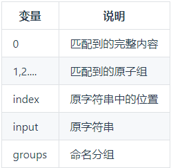

---

# 默认为文件名称
title: 

tags:
  - 正则

# 类别中已包含文件夹名称
categories:
  - js
  - 正则表达式
description: 整理了可能会用得上的 js 正则表达式知识点

# 该字段必须,格式 <YYYY-MM-DD hh:mm:ss>
publishTime: 2022-08-14 17:04:05
updateTime:
 
# 默认随机
img: 

# 目录
toc: true
---

**关于正则表达式可能用得上的知识点**

## 正则表达式

- 构造函数：`new RegExp(<正则语句>, <模式>)`
- 字面量：`/<正则语句>/<模式>`

**以下用 `R` 来代替正则表达式**

### 正则语句写法

1.   `/`：正则边界符
-  /正则语句/
2.   `\`： 转义字符
-  将正则中的特殊字符转义成普通字符，\ 本身也是特殊字符
3.   `|`：选择字符
   -  两边满足其中之一；两边是一个整体，不是两边的单个字符；使用 () 原子组分隔 | 的范围

```js
/@|u/ ;
// -> @ or u
/@@@|u/ ;
// -> @@@ or u
/@@(@|u)/ ;
// -> @@@ or @@u
```

4.  `[]`：原子表

- 括号里面取其一，其中的字符视作普通字符

```js
/[12345]/ ; //-> 括号中的一个
/[^12345]/ ; //-> 除了括号中的任一个
```

5.  `()`：原子组

- 把原子组内的表达式当成一个整体

```js
/(12|34)/ ; //-> 12 或 34
```

6.  `{}`

- 前面相同规则的个数


```js
/R{m}/ ; //-> R规则 m 次
/R{m,n}/ ; //-> R规则 m - n 次
/R{m,}/ ; //-> R规则至少 m 次
/R{,n}/ ; //-> R规则至多 n 次
```


7.  `.`：除换行符外的任一字符
8.  `?`：前面的规则 0 - 1 次，相当于 {0,1}
9.  `+`：前面的规则有1个或者多个，相当于 {1,}
10.  `*`：前面的规则有0个或者多个，相当于 {0,}
11.  `\d`：0~9 的数值，相当于[0-9]
12.  `\w`：字母、数值、下划线，相当于[a-zA-Z0-9_]
13.  `\s`：空白符，包括空格、换行、制表
14.  `\D`、`\W`、`\S`：对应的小写字母所代表的取反
15.  `^`：表示以之为开头匹配；**在 [] 中表示取反，[^]**
16.  `$`：表示以之为结尾匹配

### 模式

1. `g`：全部匹配
   - 通常情况下，当匹配成功后就不会再继续往下寻找了，添加 g 后则持续匹配，并收集所有成功匹配项为数组 
2. `i`：匹配时忽略大小写

## 使用正则的函数

### test

字符串中是否含有匹配正则的子字符串

```js
R.test(str)
// -> boolean
```

### replace

将字符串中匹配的子字符串替换成指定的字符串

```js
str1.replace(R,str2)
str1.replace(R, search => {
  // search 为所有匹配的内容 --> 处理后返回新的替换的内容
  return ...
})
// -> string
// str1 不变
```

### match | matchAll

找出满足正则的子字符串

```js
const result = str.match(R)
//-> 当 R 不为全局匹配模式时
{0,index,input,groups}
//-> 当 R 为全局匹配模式时
[] // 匹配的所有结果组成数组

const result = str.matchAll(R)
// R 必须为全局匹配模式
// 结果是一个迭代类型，调用 next() 一次返回匹配结果
result.next()
// 
{
    value, // {0,index,input,groups} 匹配对象
    done, // boolean 是否结束，后面是否还有
}
```

没有添加 g 模式修正符时只匹配到第一个，匹配到的信息包含以下数据：



### search

返回匹配的字符串中子字符串的索引

```js
str1.search( R | str2 )
// 只会找寻第一个满足的子字符串，g 模式无效
// 当为 str 时，同 indexOf()
```

## 原子组相关

使用原子组的时候, 会按原子组使用的顺序从 1 开始编号

### 使用

在 `replace`函数中：

当使用原子组时，我们知道了每一个原子组会对应其编号

```js
str.replace(str1,str2)
// 例：
"ab爸爸cd".replace(/(ab|cd)爸爸/,"++$1++")
//-> 输出：++ab++cd
str.replace(R, search => {
	    
})
// 例
"ab爸爸cd".replace(/(ab|cd)爸爸/,(search, p1) => {
	// search === "ab爸爸"
    	// p1 === ab
    return "++" + p1 + "++"
} )
//-> 输出：++ab++cd
```

1.  当第二个参数是字符串时：直接将匹配到的值替换成第二个参数
   - $& ：匹配的字符串本身
   - $`  ：匹配的字符串前的子字符串
   - $'  ：匹配的字符串后的子字符串
   - $n ：第 n 个原子组
2.  当第二个参数是回调函数时：将匹配的字符串替换成回调函数的返回
   - 第一个参数 search 是匹配的子字符串本身
   - 之后的参数是按原子组编号顺序排列的各原子组的值
   - 可以使用 `(search,...args) => {}` 的方式将所有原子组收集到 args 中，再到控制台处观察自己所需的原子组

### 组别名

当原子组交叉嵌套时，使用编号不易区分，可以给原子组进行自定义命名

```js
/(?<name>abab)/
// <> 尖括号不能省略
// 重命名为了 <name>, 通过 $<name> 引用
// 重命名后的原子组会被收集到 groups 属性中
```

### 忽略分组

在原子组的开始出使用 `?:` ，输出结果中将不记录该分组

```js
/(?:abab)/
```

## 断言

1.  `/A(?=B)/`： 匹配以 B 结束的 A
2.  `/A(?!B)/`： 匹配不以 B 结束的 A
3.  `/(?<=B)A/`“：匹配以 B 开头的 A
4.  `/(?<!B)A/`：匹配不以 B 开头的 A

`注意`：匹配的结果不包含 B

## 禁止贪婪匹配

单个匹配时会取第一个满足的，匹配是贪婪的，满足的字符越多越好

禁止贪婪：在 `? | * | + | {}` 后面再加一个 `?`


