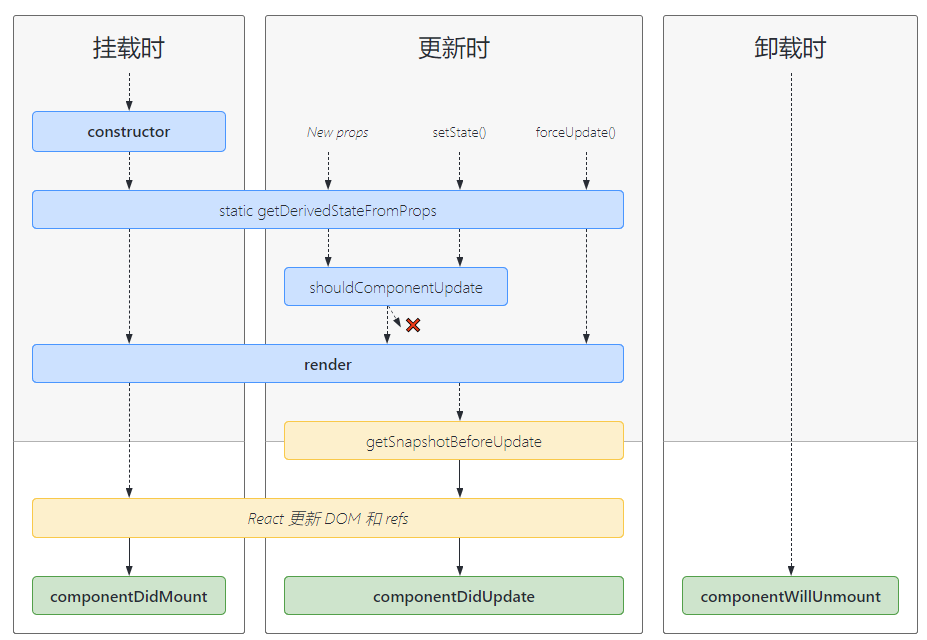

---

# 默认为文件名称
title: 

tags:
  - hooks

# 类别中已包含文件夹名称
categories:

description: 再次学习react官网文档，整理不会的知识点，hooks

# 该字段必须,格式 <YYYY-MM-DD hh:mm:ss>
publishTime: 2022-09-03 18:56:20
updateTime:
 
# 默认随机
img: 

# 目录
toc: true

# 评论
comment: true
---

# react


## class component

### 基本结构

```jsx

class Component extends React.Component {
    // 在 react dev tool 中的名称
    displayName = 
    
	// 初始化 state
	state = {
	
	}
    
    // 定义 props 类型
    static propTypes = {
        
    }
    
    // 定义 props 默认值
    static defaultProps = {
        
    }
    
    // 定义继承的上下文
    static contextType = 
    
    // 创建箭头函数
    handle = () => {
        
    }
    
    // 生命周期函数
    
    
    // 渲染函数
    render(){
        // 这里准备数据
        
        return (
            // 条件渲染
        	{ flag &&
                <></>
            }
            
            // 选择渲染
            { flag
            	? <></>
            	: <></>
            }
    		
    		// 列表渲染
    		{ lists.map(item => {
              	return (
                	<Fragments key="item.id"></Fragments>
                )  
            })}

			// 数据双向绑定
			<input type="text" value={this.state.value} onChange={this.handleChange} />

			// ref
			// 使用: this.divRef
			<div ref={el => this.divRef = el}></div>
			// this.divRef = React.createRef()
			// 使用：this.divRef.current
			<div ref={this.divRef}></div>
        )
    }
    
}


```


### 生命周期



## 高级用法

### 代码分割

#### import()

```js
// 当运行到此处时才加载
import("./math.js").then(math => {
	
})
// 打包时将以此为分割点，打包成一个 chunk
// 多处调用同一个模块只打包一份
```

#### React.lazy

懒加载一个 react 组件

```js
// 参数为返回一个 Promise 类型的回调函数，返回值是一个默认暴露的 react 组件
// 当第一次用到它时再加载
// 可以做服务端渲染
React.lazy(() => import("./component.jsx"))
```

#### Suspense

```jsx
import React, { Suspense } from 'react';
const OtherComponent = React.lazy(() => import('./OtherComponent'));
function MyComponent() {
  return (
    <div>
      <!-- 加载过程中显示 loading 组件 -->
      <Suspense fallback={<div>Loading...</div>}>
      	<!-- 内部可以放置多个懒加载组件 -->  
      	<OtherComponent />
      </Suspense>
    </div>
  );
}
```

#### startTransition

在回调函数中可能引起组件加载的动作将不会导致 suspense 展示 fallback 画面

```js
function handleTabSelect(tab) {
    startTransition(() => {
        // 该操作如果导致 suspense 内加载组件的话，将不会进入加载状态
        // 仍然展示原画面，直到组件加载完毕展示加载好的组件
        setTab(tab)
    })
}
```

 ### Context

```jsx
// 创建 context
const MyContext = React.createContext(defaultValue)

// 顶层组件
class FatherComponent extends React.Component {
  render() {
    // 使用一个 Provider
    // value 为提供的值，无论多深的任何组件都能读取这个值
    // value 变化会触发子树重新渲染
    return (
      <MyContext.Provider value="dark">
        <Toolbar />
      </MyContext.Provider>
    );
  }
}

// 中层组件无任何操作

// 需要使用的子组件
class ChildComponent extends React.Component {
  // 指定 contextType 为创建时的 MyContext。
  // React 会往上找到最近的 MyContext.Provider
  // 在这个例子中，当前的 value 值为 “dark”
  static contextType = MyContext
  render() {
    return <div value={this.context} />
  }
}

// 只有当组件所处的树中没有匹配到 Provider 时，其 defaultValue 参数才会生效


// 动态的 Context

// 订阅上层 MyContext.provider 的变化
<MyContext.Consumer>
  {value => /* 基于 context 值进行渲染*/}
</MyContext.Consumer>


// 可以设置 displayName 修改在调试工具 DevTools 中的名称
MyContext.displayName = 'MyDisplayName';
// "MyDisplayName.Provider" 在 DevTools 中
<MyContext.Provider></MyContent.provider> 
```

**注意**：将 value 的值提升到 state 中，避免每次调用 render 时 value 都是新对象，而导致子树都跟着重新渲染

### 错误边界

```jsx
class ErrorBoundary extends React.Component {
  constructor(props) {
    super(props);
    this.state = { hasError: false };
  }

  static getDerivedStateFromError(error) {
    // 更新 state 使下一次渲染能够显示降级后的 UI
    return { hasError: true };
  }

  componentDidCatch(error, errorInfo) {
    // 将错误日志上报给服务器
    logErrorToMyService(error, errorInfo);
  }

  render() {
    if (this.state.hasError) {
      // 自定义降级后的 UI 并渲染
      return <h1>Something went wrong.</h1>;
    }

    return this.props.children; 
  }
}
```


### forwardRef

父组件想用到子组件的 dom 时，可以使用这个：

```jsx
// 子组件
// 使用 React.forwardRef 来构建， 只能使用 `函数式组件`
// 第二个参数就是来自父组件的 ref，将其赋给自己内部渲染的元素，父组件就可以直接使用了
const FancyButton = React.forwardRef((props, ref) => (
  <button ref={ref} className="FancyButton">
    {props.children}
  </button>
));

// 在父组件中

// 你可以直接获取 button 的 DOM : ref.current
const ref = React.createRef();
// 将其赋给组件的 ref 属性
<FancyButton ref={ref}>Click me!</FancyButton>

// 在高阶函数中 (HOC)：将 ref 通过 props 传递
function logProps(Component) { 
  class LogProps extends React.Component {
    componentDidUpdate(prevProps) {
      console.log('old props:', prevProps);
      console.log('new props:', this.props);
    }

    render() {
      // forwardedRef 即是从父组件传过来的 ref
      const {forwardedRef, ...rest} = this.props;

      // 将自定义的 prop 属性 “forwardedRef” 定义为 ref
      return <Component ref={forwardedRef} {...rest} />;
    }
  }

  // 我们可以将其作为常规 prop 属性传递给 LogProps，例如 “forwardedRef”
  // 然后它就可以被挂载到被 LogProps 包裹的子组件上
  return React.forwardRef((props, ref) => {
    return <LogProps {...props} forwardedRef={ref} />;
  });
}

// 在 DevTools 中显示自定义名称
const WrappedComponent = React.forwardRef(
  function myFunction(props, ref) { // 具名函数
    return <LogProps {...props} forwardedRef={ref} />;
  }
);
// ForwardRef(myFunction)

// 设置 displayName
function logProps(Component) {
  class LogProps extends React.Component {
    // ...
  }

  function forwardRef(props, ref) {
    return <LogProps {...props} forwardedRef={ref} />;
  }

  // 在 DevTools 中为该组件提供一个更有用的显示名。
  // 例如 “ForwardRef(logProps(MyComponent))”
  const name = Component.displayName || Component.name;
  forwardRef.displayName = `logProps(${name})`;

  return React.forwardRef(forwardRef);
}

```

### Fragment

```react
<Fragments key="">
	...
</Fragments>

// 简写
<></>
```

### HOC

**高阶组件是参数为组件，返回值为新组件的函数**

```jsx
function HOC(Component, ...){
    return class extends React.Component {
        
        render(){
            return <Component {...this.props}/>
        }
    }
}

// 在 HOC 中，通过传入的其他参数，为组件添加特性
```

HOC是纯函数，不会对传入的组件原型进行修改，不会产生副作用

有点像**装饰器**

#### 约定

1. 将不相关的 props 传递给被包裹的组件

```jsx
render() {
  // 传递的 props 分离：
  // extraProp 是给 HOC 专门用的
  // passThroughProps 是传给组件的
  const { extraProp, ...passThroughProps } = this.props;

  // 这是 HOC 赋予给组件的属性或方法
  const injectedProp = someStateOrInstanceMethod;

  // 将 props 传递给被包装组件
  return (
    <WrappedComponent
      injectedProp={injectedProp} 
      {...passThroughProps}
    />
  );
}
```

2. 最大化可组合性

```jsx
// 不推荐如下写法...
// 看起来逻辑乱
const EnhancedComponent = withRouter(connect(commentSelector)(WrappedComponent))

// ... 建议编写组合工具函数

function compose(...funs){
    return funs.reduce((pre,cur) => (...args) => cur(pre(...args)))
}

// compose(f, g, h) 等同于 (...args) => f(g(h(...args)))
const enhance = compose(
  // 这些都是单参数的 HOC
  withRouter,
  connect(commentSelector)
)
// 组件增强：具有 withRouter | connect(commentSelector) 的增强属性
const EnhancedComponent = enhance(WrappedComponent)
```

3. 包装显示名称以便轻松调试

```jsx
function withSubscription(WrappedComponent) {
  class WithSubscription extends React.Component {/* ... */}
  WithSubscription.displayName = `WithSubscription(${getDisplayName(WrappedComponent)})`;
  return WithSubscription;
}

function getDisplayName(WrappedComponent) {
  return WrappedComponent.displayName || WrappedComponent.name || 'Component';
}
```

#### 注意

1. 不要在 render 方法中使用 HOC

HOC 每次都会返回一个新的组件，由于 react 的 diff 算法比较使用的组件是否变更为**浅比较**，组件对象被替换会导致每次更新时整个子树都会被丢弃，重新生成新的子树，消耗太大了

2. 务必复制静态方法

组件上挂载的静态方法在 HOC 返回的组件中是不存在的

```jsx
WrappedComponent.staticMethod = function() {/*...*/}
const EnhancedComponent = enhance(WrappedComponent)
// 增强组件没有 staticMethod
typeof EnhancedComponent.staticMethod === 'undefined' // true
```

使用 `hoist-non-react-statics` 复制静态方法到导出容器上

```jsx
import hoistNonReactStatic from 'hoist-non-react-statics'
function enhance(WrappedComponent) {
  class Enhance extends React.Component {/*...*/}
  hoistNonReactStatic(Enhance, WrappedComponent)
  return Enhance
}
```

3. Refs 不会从导出的容器组件中传递到内部的组件

通过 Refs 转发解决

### JSX

`React.createElement(component, props, ...children)`的**语法糖**

对于这三部分，都有一些规定：

#### component

1. 使用 component 时，一定要引用 react

```jsx
import React from 'react' // 不可省
import CustomButton from './CustomButton'

function WarningButton() {
  // return React.createElement(CustomButton, {color: 'red'}, null)
  // 如上，React 使用到了，必须导入
  return <CustomButton color="red" />
}
```

2. 可以使用**点语法**

```jsx
import React from 'react';

const MyComponents = {
  DatePicker: function DatePicker(props) {
    return <div>Imagine a {props.color} datepicker here.</div>;
  }
}

function BlueDatePicker() {
  return <MyComponents.DatePicker color="blue" />;
}
```

3. 组件**必须大写字母开头**
4. 运行时选择类型

```jsx
import React from 'react';
import { PhotoStory, VideoStory } from './stories';

const components = {
  photo: PhotoStory,
  video: VideoStory
};

function Story(props) {
  // 错误！JSX 类型不能是一个表达式。
  return <components[props.storyType] story={props.story} />;
    
  // 正确！JSX 类型可以是大写字母开头的变量。
  const SpecificStory = components[props.storyType];
  return <SpecificStory story={props.story} />;
}
```

#### props

1. 可以是 JavaScript 表达式

```jsx
<MyComponent foo={1 + 2 + 3 + 4} />
```

2. 字符串可以不加大括号，其他类型都需要加大括号

```jsx
<MyComponent message="hello world" />
<MyComponent message={1} />
<MyComponent message={true} />
<MyComponent message={object} />
```

3. 默认值为 true，但最好写上

```jsx
<MyComponent message={true} /> // 等于
<MyComponent message />


// 但需要区分
<MyComponent {message} /> // 这是 es6 简写形式，而非 message={true}
<MyComponent message={message} />
```

4. 属性展开

```jsx
const Button = props => {
  const { kind, ...other } = props
  const className = kind === "primary" ? "PrimaryButton" : "SecondaryButton"
  return <button className={className} {...other} />
}
```

#### children

1. 字符串

**JSX 会移除行首尾的空格以及空行。与标签相邻的空行均会被删除，文本字符串之间的新行会被压缩为一个空格**

2. JSX 子元素

**组件嵌套**

3. JavaScript 表达式

使用 {} 大括号，里面可以写 js 表达式

4. **函数作为子元素**

```jsx
function Repeat(props) {
  let items = [];
  for (let i = 0; i < props.numTimes; i++) {
    // props.children 为函数，接受参数 i
    items.push(props.children(i));
  }
  return <div>{items}</div>;
}

function ListOfTenThings() {
  return (
    <Repeat numTimes={10}>
      {(index) => <div key={index}>This is item {index} in the list</div>}
    </Repeat>
  );
}
```

5. 布尔类型、Null 以及 Undefined 将会忽略

但是，**`falsy` 类型的值仍然会被渲染**

```jsx
<div>
  {props.messages.length &&
    <MessageList messages={props.messages} />
  }
</div>

// 当为 false 时
<div>0<MessageList messages={props.messages} /></div>
```


### 性能优化

#### shouldComponentUpdate

```jsx
// 为 true 时(默认)，会比较虚拟 dom 和真实 dom来确定是否重新渲染
// 为 false，直接跳过该组件以及后代组件的渲染
shouldComponentUpdate(nextProps, nextState) {
  return true;
}
```

#### React.PureComponent

在 shouldComponentUpdate 中默认使用**浅比较**的方式各个字段是否一致来决定是否重新渲染

当传递的数据为对象时，只有重新构建一个新的对象代替原对象才会触发更新

例如：

- 基本数据类型：直接比较
- 数组类型：newArr = [...oldArr, newItem]
- 对象类型：newObject = {...oldObject, oldKey: newValue}


### createPortal

**将子节点渲染到存在于父组件以外的 DOM 节点**

```jsx
ReactDOM.createPortal(child, container)

// child: 任何可渲染的 React 子元素
// container: 一个 DOM 元素
```

**注意**：在真实 dom 中，child 是位于 container 中，与在什么位置使用它没有关系；但是在任何其他方面，其行为都和在使用位置的其他普通 react 节点的行为一致，包括 **context** 或是**事件冒泡**等


### Render Props

一种在 React 组件之间使用一个值为函数的 prop 共享代码的简单技术

**在父组件中使用子组件内部的数据渲染什么内容**

```jsx
// 在父组件中
<Mouse render={mouse => <p>the mouse is at ({mouse.x},{mouse.y})</p>} />

// 子组件
class Mouse extends React.Component {
  constructor(props) {
    super(props);
    this.handleMouseMove = this.handleMouseMove.bind(this);
    this.state = { x: 0, y: 0 };
  }

  handleMouseMove(event) {
    this.setState({
      x: event.clientX,
      y: event.clientY
    });
  }

  render() {
    return (
      <div style={{ height: '100vh' }} onMouseMove={this.handleMouseMove}>
        {this.props.render(this.state)}
      </div>
    );
  }
}
```

**注意**：Render Props 与 **React.PureComponent** 一起使用时，由于每一次传入的 render 函数都是一个新的对象，导致该组件每次都重新渲染，因此，在使用 Render Props 时要避免使用 React.PureComponent


### PropTypes

安装：

```shell
npm i prop-types
```

使用：

```jsx
import PropTypes from 'prop-types';

MyComponent.propTypes = {
  // 你可以将属性声明为 JS 原生类型，默认情况下
  // 这些属性都是可选的。
  optionalArray: PropTypes.array,
  optionalBool: PropTypes.bool,
  optionalFunc: PropTypes.func,
  optionalNumber: PropTypes.number,
  optionalObject: PropTypes.object,
  optionalString: PropTypes.string,
  optionalSymbol: PropTypes.symbol,

  // 任何可被渲染的元素（包括数字、字符串、元素或数组）
  // (或 Fragment) 也包含这些类型。
  optionalNode: PropTypes.node,

  // 一个 React 元素。
  optionalElement: PropTypes.element,

  // 一个 React 元素类型（即，MyComponent）。
  optionalElementType: PropTypes.elementType,

  // 你也可以声明 prop 为类的实例，这里使用
  // JS 的 instanceof 操作符。
  optionalMessage: PropTypes.instanceOf(Message),

  // 你可以让你的 prop 只能是特定的值，指定它为
  // 枚举类型。
  optionalEnum: PropTypes.oneOf(['News', 'Photos']),

  // 一个对象可以是几种类型中的任意一个类型
  optionalUnion: PropTypes.oneOfType([
    PropTypes.string,
    PropTypes.number,
    PropTypes.instanceOf(Message)
  ]),

  // 可以指定一个数组由某一类型的元素组成
  optionalArrayOf: PropTypes.arrayOf(PropTypes.number),

  // 可以指定一个对象由某一类型的值组成
  optionalObjectOf: PropTypes.objectOf(PropTypes.number),

  // 可以指定一个对象由特定的类型值组成
  optionalObjectWithShape: PropTypes.shape({
    color: PropTypes.string,
    fontSize: PropTypes.number
  }),

  // An object with warnings on extra properties
  optionalObjectWithStrictShape: PropTypes.exact({
    name: PropTypes.string,
    quantity: PropTypes.number
  }),

  // 你可以在任何 PropTypes 属性后面加上 `isRequired` ，确保
  // 这个 prop 没有被提供时，会打印警告信息。
  requiredFunc: PropTypes.func.isRequired,

  // 任意类型的必需数据
  requiredAny: PropTypes.any.isRequired,

  // 你可以指定一个自定义验证器。它在验证失败时应返回一个 Error 对象。
  // 请不要使用 `console.warn` 或抛出异常，因为这在 `oneOfType` 中不会起作用。
  customProp: function(props, propName, componentName) {
    if (!/matchme/.test(props[propName])) {
      return new Error(
        'Invalid prop `' + propName + '` supplied to' +
        ' `' + componentName + '`. Validation failed.'
      );
    }
  },

  // 你也可以提供一个自定义的 `arrayOf` 或 `objectOf` 验证器。
  // 它应该在验证失败时返回一个 Error 对象。
  // 验证器将验证数组或对象中的每个值。验证器的前两个参数
  // 第一个是数组或对象本身
  // 第二个是他们当前的键。
  customArrayProp: PropTypes.arrayOf(function(propValue, key, componentName, location, propFullName) {
    if (!/matchme/.test(propValue[key])) {
      return new Error(
        'Invalid prop `' + propFullName + '` supplied to' +
        ' `' + componentName + '`. Validation failed.'
      );
    }
  })
};

```

### StrictMode

严格模式

react 会对整个 react 树进行检查，对过期的、有风险的操作和语法给出提示。

**最重要的**：

在开发模式下，react 组件会**预渲染**一次，后再**重新渲染**一次


## APP REFERENCE

可能会用到的一些 React 方法

### React.memo

组件在相同 props 的情况下渲染相同的结果，那么你可以通过将其包装在 React.memo 中调用，以此通过**记忆组件渲染结果**的方式来提高组件的性能表现。这意味着在这种情况下，React 将跳过渲染组件的操作并直接复用最近一次渲染的结果

```jsx
// 函数式组件
function MyComponent(props) {
  /* 使用 props 渲染 */
}
// 判断是否渲染的逻辑函数
// true 不重新渲染; false 重新渲染
// 逻辑与 shouldComponentUpdate() 相反
function areEqual(prevProps, nextProps) {
  
}
export default React.memo(MyComponent, areEqual);
```

**注意**：React.memo **仅检查 props 变更**。如果函数组件被 React.memo 包裹，且其实现中拥有 useState，useReducer 或 useContext 的 Hook，当 **state 或 context 发生变化**时，它仍会重新渲染

### React.createElement

创建 react 元素

```jsx
React.createElement(
  type,
  [props],
  [...children]
)
```

### React.cloneElement

克隆 react 元素

```jsx
React.cloneElement(
  element,
  [config], // 新的 props
  [...children] // 新的 children
)

// 几乎等同于：
<element.type {...element.props} {...props}>{children}</element.type>
```

**注意**：key 和 ref 会保留到克隆的元素中，除非覆盖掉

### React.isValidElement

判断是否为一个 react 元素

```jsx
React.isValidElement(object)
```

### React.Children

提供了很多对 **this.props.children** 的处理方法

- React.Children.map

改造 children，返回新的 children

```jsx
React.Children.map(children, function[(thisArg)])
```

- React.Children.forEach

在原 children 上添加副作用

```jsx
React.Children.forEach(children, function[(thisArg)])
```

- React.Children.count

子节点数量

```jsx
React.Children.count(children)
```

- React.Children.only

判断是否只有一个子节点

```jsx
React.Children.only(children)
```

- React.Children.toArray

将整个 children 扁平化

当你想要在渲染函数中操作子节点的集合时，它会非常实用，特别是当你想要在向下传递 this.props.children 之前对内容重新排序或获取子集时

```jsx
React.Children.toArray(children)
```

### ReactDOM.flushSync

```jsx
// 从 react-dom 导入
import * as ReactDOM from 'react-dom'
```

强制 React 同步刷新提供的回调函数中的任何更新。这确保了 DOM 会被立即更新

```jsx
// Force this state update to be synchronous.
flushSync(() => {
  setCount(count + 1);
});
// By this point, DOM is updated.
```

### ReactDOM.createRoot

```jsx
// 从 react-dom/client 导入
import * as ReactDOM from 'react-dom/client'
```

为提供的容器创建 React 根元素并返回

```jsx
const root = createRoot(container[, options])
// options:
// onRecoverableError: 当 react 自动从错误中恢复时调用的可选回调
// identifierPrefix: React.useId 生成的 id 的前缀，当有多个根元素时避免冲突

// 渲染 react 组件
root.render(element)

// 卸载
root.unmount()
```


## hooks

### useState()

函数组件中添加 state 属性

```jsx
import { useState } from 'react'
// 每次渲染时不会重复初始化, defaultValue 只在第一次渲染时有用
const [something, setSomething] = useState(defaultValue)
// something: state value
// setSometing: a function to change state
// defaultValue: a value to init state
```

### useEffect()

函数组件中使用生命周期

```jsx
import { useEffect } from 'react'

// 每次渲染后执行(第一次渲染和后续重新渲染)
useEffect(
    // 相当于 componentDidMount + componentDidUpdate
    () => { // 参数1：执行函数
        return () => { } // 如果有返回的函数，组件会在重新渲染前执行它
    }
)

// 只在第一次渲染后执行
useEffect(
  () => {
      // 相当于 componentDidMount
      return () => {
          // 相当于 componentWillUnmount
      }
  },
  [] // 参数2：依赖列表(为空)
)

// 只在第一次渲染和依赖列表值发生变化后执行
// 用于监听
useEffect(
  () => {
      
  },
  [state, props, funs] // 依赖列表(含有依赖项)
)
```

**注意**：

- 监听时检查值变化是**浅比较**，而 useState 执行更新都是**替换**操作，因此状态变化必重新渲染，然后执行副作用
- 对于函数组件体中的普通数据和函数，**每次渲染时生成的都是新的对象**，如果监听会触发副作用的。需要将这些不变的数据移至函数组件外部


### Hook 规则

- **只在最顶层使用 Hook**：不要在循环，条件或嵌套函数中调用 Hook
- 只在 React 函数中调用 Hook：函数组件和自定义 hook


### 自定义 Hook

- 以 `use` 作为开头的函数
- 在函数内部可以调用其他的 hooks


### useContext()

```jsx
// 接收一个 context 对象: 由 React.createContext 创建
const value = useContext(MyContext);
// 返回上层组件中距离当前组件最近的 <MyContext.Provider> 的 value
```

**注意**：

- Hook 会触发重新渲染，即使祖先使用 React.memo 或 shouldComponentUpdate，也会在组件本身使用 useContext 时重新渲染


### useReducer()

useState 的替代方案，当 state 比较复杂时，
```jsx
const [state, dispatch] = useReducer(reducer, initialArg [, init] );

// state : 当前状态值
// dispatch : 提交变更行为的操作函数 dispatch(action)
// reducer : 形如 (state, action) => newState 的函数，注意 state 浅比较决定是否重新渲染
// initialArg : 
//     - 当无 init 时: initialArg 作为 state 的初始值
// 	   - 当有 init 时：init(initailArg) 作为 state 的初始值
// init : 从 initialArg 生成 state 的初始值


function useReduce(reducer, initailArg, init) {
  const initValue = init && init instanceof Function ? init(initailArg) : initailArg
  const [value, setValue] = useState(initValue)
  const dispatch = useCallback(action => {
    const newValue = reducer(value, action)
    setValue(newValue)
  }, [])
  return [value, dispatch]
}
```

**注意**：

- dispatch 所对应更改的 state 是固定的，不会随着重新渲染而变化，因此不用把它加入到 useEffect 的依赖列表中


### useCallback()

用于优化，避免子组件不必要的 render， 返回一个 memoized 回调函数

```jsx
// 返回一个函数
const memoizedCallback = useCallback(
  () => { // 该回调函数只在依赖列表更新时才更新
    doSomething(a, b);
  },
  [a, b], // 依赖列表
);
```

使用场景：

- 给子组件传递一个函数作为prop，当父组件更新时，由于函数是重新生成的，导致子组件也会跟着重新渲染，这时使用 useCallback 便会生成一个只有在依赖项发生变化时才重新生成的函数，也就是说当依赖项不变时，该函数一直保持不变，所以子组件也不会跟着重新渲染
- 用于callback 中依赖项不经常变化的情形


### useMemo()

用于优化，避免在每次渲染时都进行高开销的计算，返回一个 memoized 值

有点像 vue 的计算属性，但是要手动写明依赖列表

```jsx
const memoizedValue = useMemo(() => computeExpensiveValue(a, b), [a, b]);
```


### useRef()

函数式组件中使用 Ref

```jsx
const refContainer = useRef(initialValue);
// 值为 refContainer.current
return (
	<input ref={refContainer} type="text" />
)

```

**注意**：

- useRef 所创建的 ref 可以保存任何可变值，且当 ref 的值发生变化时不会触发重新渲染
- useRef 不需要添加到依赖数组中，因为它一直存在，不会随组件重新渲染而更新
- **在函数组件中不要使用 `createRef`**，会造成 ref 丢失，因为函数组件没有实例，用 useRef 代替


### useImperativeHandle()

用于 `forwardRef` 向父组件暴露 ref 时自定义暴露的实例值

```jsx
FancyInput = React.forwardRef( (props, ref) => {
  const inputRef = useRef();
  // 来自父组件的 ref 作为第一个参数
  // 第二个参数返回一个对象，包含了暴露给父组件的属性和操作函数
  useImperativeHandle(ref, () => ({
    focus: () => {
      inputRef.current.focus();
    }
  }));
  return <input ref={inputRef} ... />;
});

// 父组件中
<FancyInput ref={inputRef} />
// 可以调用暴露的方法
inputRef.current.focus()
```

### useLayoutEffect()

使用同 `useEffect`

区别是：

- useEffect 会在组件渲染到屏幕之后执行副作用函数
- useLayoutEffect 在虚拟dom更新到真实dom后执行副作用函数，然后同步副作用函数所引起的数据变化，如果数据发生变化，再次将虚拟dom更新到真实dom，而后组件才会渲染
- 一般而言用 useEffect 即可


### useDeferredValue()

```jsx
const deferredValue = useDeferredValue(value, { timeoutMs: NumberOfMS });
// deferredValue 是 value 的一个副本
// 但是 deferredValue 并不会实时的与 value 同步
// 而是在延迟了 NumberOfMS ms 后变更为实时的值
```

这个有点像 react 专门提供的防抖，但是它与防抖有区别的是 timeoutMs 是**最高的延迟**，超出这个时间就会同步。但是可能子组件在这个时间内就已经加载完毕了，他会自动采用更低的延迟，

```jsx
function Typeahead() {
  const query = useSearchQuery('');
  const deferredQuery = useDeferredValue(query, { timeoutMs: 2000 });

  // Memoizing 告诉 React 仅当 deferredQuery 改变，
  // 而不是 query 改变的时候才重新渲染
  // useMemo : props 相同时不重新计算
  const suggestions = useMemo(() =>
    <SearchSuggestions query={deferredQuery} />,
    [deferredQuery]
  );

  return (
    <>
      <SearchInput query={query} />
      // 加载过程中显示 fallback
      <Suspense fallback="Loading results...">
        {suggestions}
      </Suspense>
    </>
  );
}
```


### useTransition()

返回一个状态值表示过渡任务的等待状态，以及一个启动该过渡任务的函数。

```jsx
const [isPending, startTransition] = useTransition();
// startTransition 用于执行一个任务，只有当任务执行完后才会进行重新渲染，更新视图
// isPending 用于判断过渡任务是否活跃以显示一个等待状态
```


## 总结

以上就是阅读完 react 文档后提取的可能会用到的全部内容！


