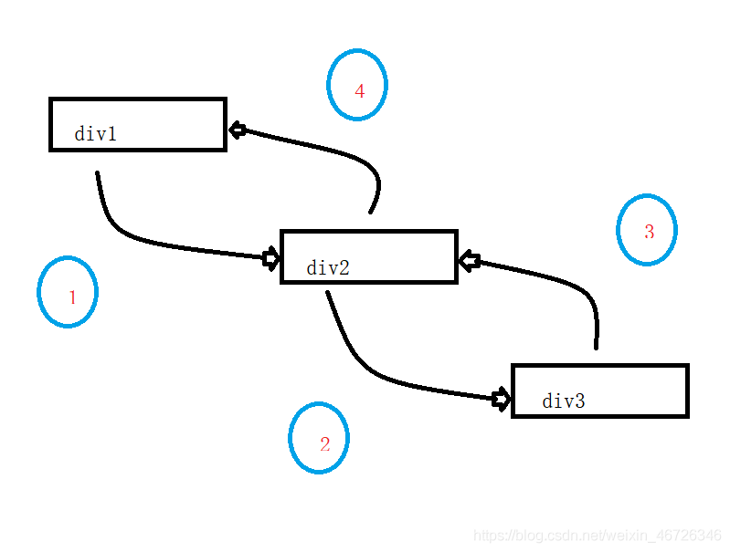

---

# 默认为文件名称
title: 

tags:
  - 事件捕获
  - 事件冒泡

# 类别中已包含文件夹名称
categories:

description: 当触发一个dom元素上绑定的一个事件，事件是如何传播的呢？捕获和冒泡阶段是指？

# 该字段必须,格式 <YYYY-MM-DD hh:mm:ss>
publishTime: 2022-09-16 23:25:30
updateTime: 2022-09-22 22:02:13
 
# 默认随机
img: 

# 目录
toc: false

# 评论
comment: true

# 发布
publish: true

---

## Js 事件流

> 事件流描述的是从页面中接受事件的顺序

IE的事件流是**事件冒泡流**，而Netscape的事件流是**事件捕获流**。后来在 W3C 组织的统一之下，JS 支持了冒泡流和捕获流

- 事件冒泡流：从目标事件开始，向最外层父元素传递
- 事件捕获流：从最外层父元素流向目标元素
- Dom 流：**事件捕获阶段**、**处于目标阶段**、**事件冒泡阶段**



以上示例中：

点击事件绑定在 div2 中，当点击在 div3 上时：

`1 -> div2`：捕获阶段触发 div2 点击事件

`2 -> div3`：捕获到目标点击元素，目标执行阶段

`3 -> div2`：冒泡阶段触发 div2 点击事件

`4 -> div1`：冒泡到最外层父元素


## 事件处理程序

响应某个事件的函数就叫做事件处理程序（事件监听器），事件处理程序的名字以`on`开头，`click => onclick`、`load => onload`

DOM2 提供了两个方法来让我们处理和删除事件处理程序的操作：`addEventListener()`和`removeEventListener`，其中的第三个参数能够规定采用什么事件流

```js
btn.addEventListener('click', function (event) {
	console.log('事件捕获')
}, true)

btn.addEventListener('click', function (event) {
	console.log('事件冒泡')
}, false) // 默认，更兼容

// 更多选项
btn.addEventListener('click', function (event) {
    // todo
}, {
    capture: false, // 冒泡还是捕获
    once: false, // 最多只触发一次，触发后自动去除
    passive: false, // 是否支持去除默认事件
    signal: aAbortSignal // 该 AbortSignal 的 abort() 方法被调用时，监听器会被移除
})
```

**如果给一个 body 中的子节点同时注册冒泡和捕获事件，事件触发会按照注册的顺序执行。**

`event` 为事件对象，里面包含着所有和事件有关的信息

常用属性和方法有：

- target：绑定该事件的元素
- currentTarget：真正触发该事件的目标元素
- preventDefault：取消事件的默认行为
- stopPropagation：作用在后续节点上，**在执行完绑定到当前元素上的所有事件处理程序之后，停止执行所有后续节点的事件处理程序**
- stopImmediatePropagation：作用在当前节点以及事件链上的所有后续节点上，**在执行完当前事件处理程序之后，停止当前节点以及所有后续节点的事件处理程序的运行**


