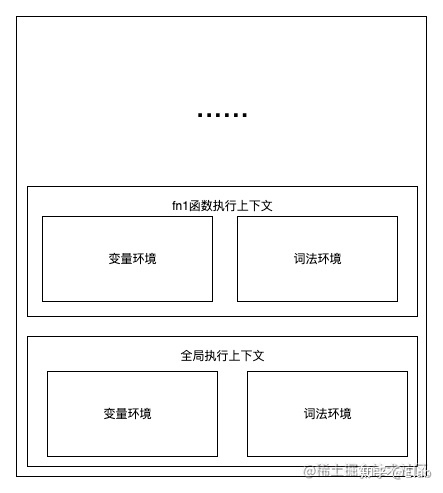
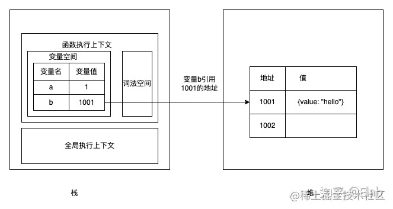
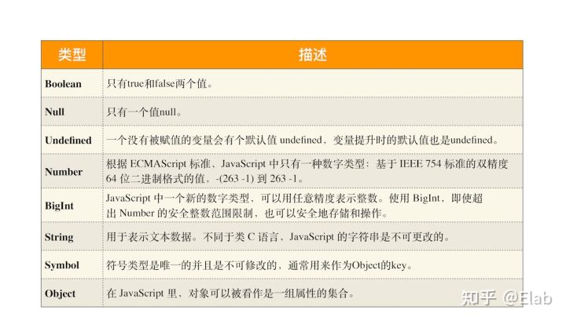

---

# 默认为文件名称
title: 

tags:
  - 数据类型
  - 存储方式

# 类别中已包含文件夹名称
categories:

description: js 有哪些数据类型，数据是怎样存储在内存中的呢？

# 该字段必须,格式 <YYYY-MM-DD hh:mm:ss>
publishTime: 2022-09-04 18:21:27
updateTime:
 
# 默认随机
img: 

# 目录
toc: false

# 评论
comment: true

# 发布
publish: true
---

### 栈空间和堆空间

JS 内存空间包括：

- **代码空间**：用来存放可执行代码
- **栈空间**：一块连续的内存区域，容量较小，读取速度快，被设计成先进后出结构
- **堆空间**：不连续的内存区域，容量较大，用于储存大数据，读取速度慢

栈空间其实就是 JavaScript 中的调用栈，是用来储存执行上下文，以及存储执行上下文中的一些基本类型中的小数据，如下图所示：

**变量环境**：存放 var 声明与函数声明的变量空间，编译时就能确定，不受块级作用域影响

注意：**函数声明的优先级高于 var**，变量提升时放在最前面

**词法环境：** 存放 let 与 const 声明的变量空间，编译时不能完全确定，受块级作用域影响

而堆空间，则是用来储存大数据如引用类型，然后把他们的引用地址保存到栈空间的变量中，所以多了这一道中转，JavaScript 对堆空间数据的读取自然会比栈空间数据的要慢，可以用下图表示两者关系：

通常情况下，栈空间都不会设置太大，这是因为 JavaScript 引擎需要用栈来维护程序执行期间上下文的状态，如果栈空间大了的话，所有的数据都存放在栈空间里面，那么会影响到上下文切换的效率，进而又影响到整个程序的执行效率。

### 数据存储方式

JS 的数据类型包括：

JavaScript 发展至今总共有八种数据类型，其中 Object 类型称为引用类型，其余七种称为基本类型，Object 是由其余七种基本类型组成的kv结构数据

Object 包括：Object、Function、Array、RegExp、Date 

#### 数字

v8 将数字类型分为了两种：Smi (small integer) 和 heapNumber

- Smi：-2³¹ 到 2³¹-1的整数，在栈中直接存值
- heapNumber：其他的所有数，需要另外开辟堆空间进行储存，变量保存其引用

#### oddball

属于 oddball 类型的有null、undefined、true和false

是存在堆里面的固定值，在V8跑起来的第一时间，不管有没有声明这些基本类型，他们都已经在堆中被创建完毕了，所以这些值不是存在栈中的，都是引用的堆里面的地址

#### bigInt、string、symbol

这三种类型占用的内存大小不是一个固定值，需要根据其值进行动态分配，所以内存地址会进行更换

因为栈是一块连续的内存空间，不希望运行中会产生内存碎片，由此可以得出bigInt、string、symbol这些内存大小不固定的类型在栈中也是保存其堆内存的引用。同时我们在栈中可以声明很大的string，如果string存放在栈中明显也不合理

#### 存储方式

| 数据类型   | 栈？ | 堆？ |
| ---------- | ---- | ---- |
| Smi        | *    |      |
| heapNumber |      | *    |
| null       |      | *    |
| undefined  |      | *    |
| Boolean    |      | *    |
| string     |      | *    |
| bigInt     |      | *    |
| symbol     |      | *    |
| Object     |      | *    |

