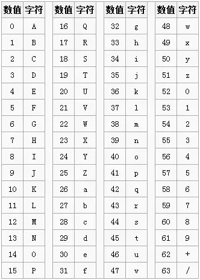

---

# 默认为文件名称
title: 

tags:

# 类别中已包含文件夹名称
categories:

description: 前端为什么要使用 base64 呢？base64 是怎么编码的？

# 该字段必须,格式 <YYYY-MM-DD hh:mm:ss>
publishTime: 2022-09-28 02:19:25
updateTime:
 
# 默认随机
img: 

# 目录
toc: true

# 评论
comment: true

# 发布
publish: true

---

## 格式

```
data:[<mime type>][;base64],<data>
```

其中 `data` 为数据本身

## 由来

为什么会有Base64编码呢？因为有些**网络传送渠道并不支持所有的字节**，例如传统的邮件只支持可见字符的传送，像ASCII码的控制字符就不能通过邮件传送。这样用途就受到了很大的限制，比如图片二进制流的每个字节不可能全部是可见字符，所以就传送不了。最好的方法就是在不改变传统协议的情况下，做一种扩展方案来**支持二进制文件的传送**。把不可打印的字符也能用可打印字符来表示，问题就解决了。Base64编码应运而生，Base64就是一种基于64个可打印字符来表示二进制数据的表示方法。

## 编码索引

Base64的索引表如下，字符选用了"A-Z、a-z、0-9、+、/" 64个可打印字符。数值代表字符的索引，这个是标准Base64协议规定的，不能更改。




## 编码原理

Base64的码表只有64个字符， 如果要表达64个字符的话，使用6个 bit 即可完全表示(2^6为64)。因为Base64的编码只有6个bit即可表示，而正常的字符是使用8个bit表示， 8和6的最小公倍数是24，所以4个Base64字符可以表示3个标准的ascll字符；

对以某编码方式编码后的字节数组为对象，以3个字节为一组，按顺序排列24bit数据，然后以6bit一组分成4组；再在每组的最高位补2个0凑足一个字节。这时一组就有4个字节了。若字节数组不是3的倍数，那么最后一组就填充1到2个0字节；

然后按Base64编码方式（就是映射关系）对字节数组进行解码，就会得到平时看到的Base64编码文本。对于字节数组不是3的倍数，最后一组填充1到2个0字节的情况，填补的0字节对应的是=（等号）。


## 实现

```js
function Base64() {

    // private property  
    _keyStr = "ABCDEFGHIJKLMNOPQRSTUVWXYZabcdefghijklmnopqrstuvwxyz0123456789+/=";

    // public method for encoding  
    this.encode = function(input) {
        let output = "";
        let chr1, chr2, chr3, enc1, enc2, enc3, enc4;
        let i = 0;
        input = _utf8_encode(input);
        while (i < input.length) {
            chr1 = input.charCodeAt(i++);
            chr2 = input.charCodeAt(i++);
            chr3 = input.charCodeAt(i++);
            enc1 = chr1 >> 2;
            enc2 = ((chr1 & 3) << 4) | (chr2 >> 4);
            enc3 = ((chr2 & 15) << 2) | (chr3 >> 6);
            enc4 = chr3 & 63;
            if (isNaN(chr2)) {
                enc3 = enc4 = 64;
            } else if (isNaN(chr3)) {
                enc4 = 64;
            }
            output = output +
                _keyStr.charAt(enc1) + _keyStr.charAt(enc2) +
                _keyStr.charAt(enc3) + _keyStr.charAt(enc4);
        }
        return output;
    }

    // public method for decoding  
    this.decode = function(input) {
        let output = "";
        let chr1, chr2, chr3;
        let enc1, enc2, enc3, enc4;
        var i = 0;
        input = input.replace(/[^A-Za-z0-9\+\/\=]/g, "");
        while (i < input.length) {
            enc1 = _keyStr.indexOf(input.charAt(i++));
            enc2 = _keyStr.indexOf(input.charAt(i++));
            enc3 = _keyStr.indexOf(input.charAt(i++));
            enc4 = _keyStr.indexOf(input.charAt(i++));
            chr1 = (enc1 << 2) | (enc2 >> 4);
            chr2 = ((enc2 & 15) << 4) | (enc3 >> 2);
            chr3 = ((enc3 & 3) << 6) | enc4;
            output = output + String.fromCharCode(chr1);
            if (enc3 != 64) {
                output = output + String.fromCharCode(chr2);
            }
            if (enc4 != 64) {
                output = output + String.fromCharCode(chr3);
            }
        }
        output = _utf8_decode(output);
        return output;
    }

    // private method for UTF-8 encoding  
    _utf8_encode = function(string) {
        string = string.replace(/\r\n/g, "\n");
        let utftext = "";
        for (let n = 0; n < string.length; n++) {
            let c = string.charCodeAt(n);
            if (c < 128) {
                utftext += String.fromCharCode(c);
            } else if ((c > 127) && (c < 2048)) {
                utftext += String.fromCharCode((c >> 6) | 192);
                utftext += String.fromCharCode((c & 63) | 128);
            } else {
                utftext += String.fromCharCode((c >> 12) | 224);
                utftext += String.fromCharCode(((c >> 6) & 63) | 128);
                utftext += String.fromCharCode((c & 63) | 128);
            }

        }
        return utftext;
    }

    // private method for UTF-8 decoding  
    _utf8_decode = function(utftext) {
        let string = "";
        let i = 0;
        let c = c1 = c2 = 0;
        while (i < utftext.length) {
            c = utftext.charCodeAt(i);
            if (c < 128) {
                string += String.fromCharCode(c);
                i++;
            } else if ((c > 191) && (c < 224)) {
                c2 = utftext.charCodeAt(i + 1);
                string += String.fromCharCode(((c & 31) << 6) | (c2 & 63));
                i += 2;
            } else {
                c2 = utftext.charCodeAt(i + 1);
                c3 = utftext.charCodeAt(i + 2);
                string += String.fromCharCode(((c & 15) << 12) | ((c2 & 63) << 6) | (c3 & 63));
                i += 3;
            }
        }
        return string;
    }
}
```

## 工具函数

```js
function stringToBase64(str) {
  return btoa(encodeURIComponent(str))
}

function base64ToString(base64) {
  return decodeURIComponent(atob(base64))
}

function blobToBase64(blob){
	const fileReader = new FileReader()
	return new Promise((resolve,reject) => {
		fileReader.onload = e => resolve(e.target.result)
		fileReader.onerror = error => reject(error)
		fileReader.readAsDataURL(blob)
    })
}

function base64ToBlob(base64) {
  const mimeString = base64.split(';')[0].split(':')[1]
  const byteString = atob(base64.split(',')[1])
  const arrayBuffer = new ArrayBuffer(byteString.length)
  const intArray = new Uint8Array(arrayBuffer)
  for (let i = 0; i < byteString.length; i++) {
    intArray[i] = byteString.charCodeAt(i)
  }
  return new Blob([intArray], { type: mimeString })
}
```


