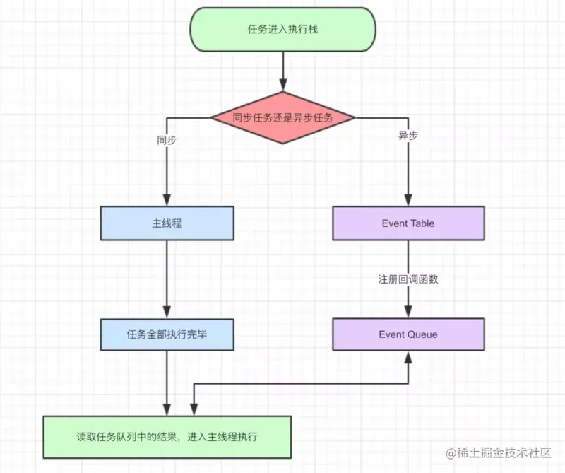

---

# 默认为文件名称
title: 

tags:
  - 宏任务
  - 微任务
  - 事件循环

# 类别中已包含文件夹名称
categories:

description: 异步的代码是怎么按部就班的运行的，宏任务与微任务什么时候执行，页面渲染是在什么时候进行的，promise 与 setTimeout 的执行顺序？

# 该字段必须,格式 <YYYY-MM-DD hh:mm:ss>
publishTime: 2022-09-04 13:30:36
updateTime:
 
# 默认随机
img: 

# 目录
toc: true

# 评论
comment: true

# 发布
publish: true
---

## 关于Event Loop的理解

### MacroTask | MicroTask

在 JavaScript 中，任务被分为两种，一种宏任务（`MacroTask`）也叫`Task`，一种叫微任务（`MicroTask`)

- MacroTask：`setTimeout`、`setInterval`、`setImmediate`(浏览器不支持)、`I/O`、`UI Rendering`等
- MicroTask：`Process.nextTick`(Node独有)、`Promise`、`MutationObserver`、`async awite`

### main thread | call stack

-  main thread：主线程，执行线程，用于执行各种JS代码
-  call stack：调用栈、执行栈，采用的是后进先出的规则，当函数执行的时候，会被添加到栈的顶部，当执行完成后，就会从栈顶移出，直到栈内被清空

由调用栈来调取任务，由主线程来执行任务

### 同步任务 | 异步任务

- 同步任务：会在调用栈中按照顺序等待主线程依次执行
- 异步任务：会在异步任务有了结果后，将注册的回调函数放入任务队列中等待主线程空闲的时候（调用栈被清空），被读取到栈内等待主线程的执行

### Task Queue

任务队列，先进先出

- 宏任务队列
- 微任务队列

### 事件循环图

分析：

- 一个任务进入执行栈，里面有很多代码，这些代码也可以看成一个个的小任务，有的是同步任务，有的是异步任务
- 同步任务交给主线程直接执行
- 异步任务等待异步任务完成后(如延迟一定时间、请求操作等)放到任务队列中等待主线程空闲
- 主线程执行完当前调用栈中的任务后，调用栈又从某一任务队列中调取队首的任务执行
- 如上构成循环

### 宏任务和微任务的处理

宏任务放在宏任务队列中，微任务放在微任务队列中，调用栈从哪个队列中选择呢？

一开始执行 script 代码时，所有的代码当作一个 `main` 任务，直接放置于调用栈中由主线程执行，此时各个任务队列都是空的，随着 main 的执行，调用 webAPIs 产生了各种宏任务和微任务放在相应的队列中。

main 执行完成后，首先观察微任务队列是否为空，不为空取出执行，直到微任务队列为空才停止。**注意**：微任务本身也可能产生新的宏任务和微任务，新的微任务也会进入到队列中，增加需要在这个循环里面的微任务的数量。

微任务队列为空后，调用栈会从宏任务队列的队首取出一个任务执行，这个宏任务也可能会产生新的宏任务和微任务，宏任务进入宏任务队列的队尾，微任务使微任务队列又有了内容。

当这个宏任务执行完后，调用栈又会检查微任务栈是否为空，不为空循环执行直到为空。

值得注意的是：**在 main任务和每一次宏任务执行完毕后，UI render 都会重新渲染一次**

### 整体顺序

1. main 任务
2. All MicroTasks
3. UI 渲染
4. All MicroTasks
5. A MacroTask
6. All MicroTasks
7. UI 渲染
8. All MicroTasks
9. 5 -8 循环直到所有任务完成

### FAQ

1. 我不认为 main 任务是一个宏任务，虽然他们都是一样的执行顺序，但是 main 任务一开始就进入到执行中，并没有进入到宏任务队列中过。
2. 微任务产生的微任务不会放到下次执行，微任务队列为空包含此次产生的微任务也执行完毕了的意思
3. 每一次 宏任务结束后都会执行一次 UI render 渲染，UI render 也被视为宏任务，它执行完后也会去执行完微任务队列，但一般情况下，这时没有微任务在里面，因为 UI render 本身不会产生微任务出来，但是可以认为的添加。比如说：**vue 的 nextTic 就是将将要执行的异步任务放在 dom 渲染之后执行，而不是放在宏任务队列中的某个宏任务执行后的微任务队列中，这样就避免了 UI render 执行两次渲染后才执行**

