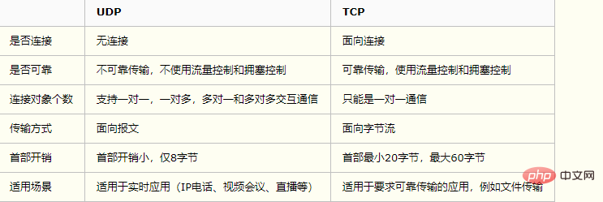

---

# 默认为文件名称
title: 

tags:
  - http1.0
  - http1.1
  - http2.0
  - https
  - 响应码
  - 头部字段
  - TCP
  - UDP
  - Content-Type
  - GET与POST

# 类别中已包含文件夹名称
categories:

description: 从http1.0到http1.1再到http2.0中间发生了一些什么变化呢? http 与 https 差别在哪里? 有哪些响应码？有哪些头部字段？TCP与UDP有什么区别?

# 该字段必须,格式 <YYYY-MM-DD hh:mm:ss>
publishTime: 2022-09-11 00:14:08
updateTime: 2022-09-11 00:27:46
 
# 默认随机
img: 

# 目录
toc: true

# 评论
comment: true

# 发布
publish: true
---


## http1.0到http1.1

1. 长连接

在 HTTP 1.0 中，默认使用的是短连接，也就是说，每次请求都要重新建立一次连接；在HTTP 1.1 中，默认使用长连接，默认开启Connection: keep-alive。HTTP是基于TCP/IP协议的，每一次建立或者断开都需要重新三次握手、四次挥手，比较耗时。

HTTP 1.1连接方式有 流水线方式 和 非流水线方式。

- **流水线方式** ：客户在收到 HTTP 响应报文之前就能接着发送新的请求报文
- **非流水线方式**： 客户在收到 HTTP 前一个响应之后，才能发送下一个请求

2. 错误状态码

在 HTTP 1.1 中新增了24个错误状态码，如409（Confilct） 表示请求的资源与资源当前状态发送冲突，410 (Gone)表示服务器上某个资源被永久删除

3. 缓存处理

在 HTTP 1.0 中，主要使用header里的If-Modified-Since, Expires来作为缓存判断的标准

在 HTTP 1.1 中，引入了更多的缓存控制策略，例如：Entity tag，If-Unmodified-Since, If-Match, If-None-Match 等更多可供选择的缓存头来控制缓存策略

4. 带宽优化及网络连接的使用

在 HTTP 1.0 中，存在一些浪费带宽的现象，例如客户端只是需要某个对象的一部分，而服务器却将整个对象送过去

不支持断点续传功能

在HTTP 1.1 中，引入了 range 头域，它允许只请求资源的某个部分，即返回码是206（Partial Content），这样就方便了开发者自由的选择以便于充分利用带宽和连接


## http1.1到http2.0

1. 二进制而非文本格式

比起像HTTP/1.x这样的文本协议，二进制协议解析起来更高效、“线上”更紧凑，更重要的是错误更少

2. 多路复用

HTTP2.0 使用了多路复用的技术，做到**同一个连接并发处理多个请求**，而且并发请求的数量比HTTP1.1大了好几个数量级。HTTP1.1也可以多建立几个TCP连接，来支持处理更多并发的请求，但是创建TCP连接本身也是有开销的。

3. 头部数据压缩

在HTTP1.1中，HTTP请求和响应都是由状态行、请求/响应头部、消息主体三部分组成。一般而言，消息主体都会经过gzip压缩，或者本身传输的就是压缩过后的二进制文件，但状态行和头部却没有经过任何压缩，直接以纯文本传输。随着Web功能越来越复杂，每个页面产生的请求数也越来越多，导致消耗在头部的流量越来越多，尤其是每次都要传输UserAgent、Cookie这类不会频繁变动的内容，完全是一种浪费

4. 服务器推送

当浏览器请求一个网页时，服务器将会发回HTML，在服务器开始发送JavaScript、图片和CSS前，服务器需要等待浏览器解析HTML和发送所有内嵌资源的请求。**服务器推送服务通过“推送”那些它认为客户端将会需要的内容到客户端的缓存中，以此来避免往返的延迟**


## http和https的区别

**Http：**

HyperText Transfer Protocol，超文本传输协议，是互联网上使用最广泛的一种协议，所有WWW文件必须遵循的标准。HTTP协议传输的数据都是未加密的，也就是明文的，因此使用HTTP协议传输隐私信息非常不安全。

使用TCP端口为：80

**Https：**

Hyper Text Transfer Protocol over Secure Socket Layer，安全的超文本传输协议，设计了**SSL**(Secure Sockets Layer)协议用于对Http协议传输的数据进行加密，保证会话过程中的安全性。

使用TCP端口默认为443


**SSL协议加密方式**：

SSL协议**既用到了对称加密也用到了非对称加密(公钥加密)**，在建立传输链路时，SSL首先对对称加密的密钥使用公钥进行非对称加密，链路建立好之后，SSL对传输内容使用对称加密。

- 对称加密：速度高，可加密内容较大，用来加密会话过程中的消息
- 公钥加密：加密速度较慢，但能提供更好的身份认证技术，用来加密对称加密的密钥


## http响应码

**1xx 表示【临时响应】并需要请求者继续执行操作的状态代码**

`100(继续)`请求者应当继续提出请求。服务器返回此代码表示已收到请求的第一部分，正在等待其余部分。

`101(切换协议)`请求者已要求服务器切换协议，服务器已确认并准备切换。

**2xx 表示【成功】处理了请求的状态代码**

`200(成功)`服务器已成功处理了请求。通常，这表示服务器提供了请求的网页。

`201(已创建)`请求成功并且服务器创建了新的资源。

`202(已接受)`服务器已接受请求，但尚未处理。

`203(非授权信息)`服务器已成功处理了请求，但返回的信息可能来自另一来源。

`204(无内容)`服务器成功处理了请求，但没有返回任何内容。

`205(重置内容)`服务器成功处理了请求，但没有返回任何内容。

`206(部分内容)`服务器成功处理了部分 GET 请求。

**3xx 表示要完成请求，需要进一步操作。通常，这些状态代码用来【重定向】**

`300(多种选择)`针对请求，服务器可执行多种操作。服务器可根据请求者(user agent)选择一项操作，或提供操作列表供请求者选择。

`301(永久移动)`请求的网页已永久移动到新位置。服务器返回此响应(对 GET 或 HEAD 请求的响应)时，会自动将请求者转到新位置。

`302(临时移动)`服务器目前从不同位置的网页响应请求，但请求者应继续使用原有位置来进行以后的请求。

`303(查看其他位置)`请求者应当对不同的位置使用单独的 GET 请求来检索响应时，服务器返回此代码。

`304(未修改)`自从上次请求后，请求的网页未修改过。服务器返回此响应时，不会返回网页内容。

`305(使用代理)`请求者只能使用代理访问请求的网页。如果服务器返回此响应，还表示请求者应使用代理。

`307(临时重定向)`服务器目前从不同位置的网页响应请求，但请求者应继续使用原有位置来进行以后的请求。

**4xx 表示【请求可能出错】，妨碍了服务器的处理**

`400(错误请求)`表示客户端请求的语法错误，服务器无法理解，例如 url 含有非法字符、json 格式有问题。

`401(未授权)`请求要求身份验证。对于需要登录的网页，服务器可能返回此响应。

`402`表示保留，将来使用。

`403(禁止)`表示服务器理解请求客户端的请求，但是拒绝请求。

`404(未找到)`服务器无法根据客户端的请求找到资源(网页)。

`405(方法禁用)`禁用请求中指定的方法。

`406(不接受)`无法使用请求的内容特性响应请求的网页。

`407(需要代理授权)`此状态代码与 401(未授权)类似，但指定请求者应当授权使用代理。

`408(请求超时)`服务器等候请求时发生超时。

`409(冲突)`服务器在完成请求时发生冲突。服务器必须在响应中包含有关冲突的信息。

`410(已删除)`如果请求的资源已永久删除，服务器就会返回此响应。

`411(需要有效长度)`服务器不接受不含有效内容长度标头字段的请求。

`412(未满足前提条件)`服务器未满足请求者在请求中设置的其中一个前提条件。

`413(请求实体过大)`表示响应实在太大。服务器拒绝处理当前请求，请求超过服务器所能处理和允许的最大值。

`414(请求的 URI 过长)`请求的 URI(通常为网址)过长，服务器无法处理。

`415(不支持的媒体类型)`请求的格式不受请求页面的支持。

`416(请求范围不符合要求)`如果页面无法提供请求的范围，则服务器会返回此状态代码。

`417(未满足期望值)`在请求头 Expect 指定的预期内容无法被服务器满足(力不从心)。

`420`表示方法失效

`422`表示不可处理的实体。请求格式正确，但是由于含有语义错误，无法响应。

**5xx 表示【服务器】在尝试处理请求时发生内部错误。这些错误可能是服务器本身的错误，而不是请求出错**

`500(服务器内部错误)`服务器遇到了一个未曾预料的状况，导致了它无法完成对请求的处理。

`501(尚未实施)`服务器不具备完成请求的功能。例如，服务器无法识别请求方法时可能会返回此代码。

`502(错误网关)`服务器作为网关或代理，从上游服务器收到无效响应。

`503(服务不可用)`服务器目前无法使用(由于超载或停机维护)。通常，这只是暂时状态。

`504(网关超时)`服务器作为网关或代理，但是没有及时从上游服务器收到请求。

`505(HTTP 版本不受支持)`服务器不支持请求中所用的 HTTP 版本。

## http头部


### 请求头

1. Accept

浏览器可以接受服务器回发的数据类型

2. Accept-Encoding

浏览器申明自己接收的编码方法，通常指定压缩方法，是否支持压缩，支持什么压缩方法（gzip）

3. Accept-Language

浏览器申明自己接收的语言

4. Connection

Connection: keep-alive  当一个网页打开完成后，客户端和服务器之间用于传输HTTP数据的TCP连接不会关闭，如果客户端再次访问这个服务器上的网页，会继续使用这一条已经建立的连接。

5. Host（发送请求时，该报头域是必需的）

请求报头域主要用于指定被请求资源的Internet主机和端口号，它通常从HTTP URL中提取出来的

6. Referer

当浏览器向web服务器发送请求的时候，一般会带上Referer，告诉服务器我是从哪个页面链接过来的，服务器籍此可以获得一些信息用于处理。

7. User-Agent

告诉服务器， 客户端使用的操作系统和浏览器的名称和版本

8. Cache-Control

private：默认为private  响应只能够作为私有的缓存，不能再用户间共享

public：响应会被缓存，并且在多用户间共享。正常情况, 如果要求HTTP认证,响应会自动设置为 private.

must-revalidate：响应在特定条件下会被重用，以满足接下来的请求，但是它必须到服务器端去验证它是不是仍然是最新的。

no-cache：响应不会被缓存,而是实时向服务器端请求资源。

max-age=10：设置缓存最大的有效时间，但是这个参数定义的是时间大小（比如：60）而不是确定的时间点。单位是[秒 seconds]。

no-store：在任何条件下，响应都不会被缓存，并且不会被写入到客户端的磁盘里，这也是基于安全考虑的某些敏感的响应才会使用这个。


9. Cookie

10. Range（用于断点续传）

Range:bytes=0-5 指定第一个字节的位置和最后一个字节的位置。用于告诉服务器自己想取对象的哪部分。


### 响应头

1. Cache-Control
2. Content-Type

Content-Type：text/html;charset=UTF-8 告诉客户端，资源文件的类型，还有字符编码，客户端通过utf-8对资源进行解码，然后对资源进行html解析。通常我们会看到有些网站是乱码的，往往就是服务器端没有返回正确的编码

3. Content-Encoding

Content-Encoding:gzip 告诉客户端，服务端发送的资源是采用gzip编码的，客户端看到这个信息后，应该采用gzip对资源进行解码

4. Date：发送时间
5. Server：服务器和相对应的版本，只是告诉客户端服务器信息
6. Transfer-Encoding

Transfer-Encoding：chunked 这个响应头告诉客户端，服务器发送的资源的方式是分块发送的。一般分块发送的资源都是服务器动态生成的，在发送时还不知道发送资源的大小，所以采用分块发送，每一块都是独立的，独立的块都能标示自己的长度，最后一块是0长度的，当客户端读到这个0长度的块时，就可以确定资源已经传输完了。

7. Expires

Expires:Sun, 1 Jan 1994 01:00:00 GMT 这个响应头也是跟**缓存**有关的，告诉客户端在这个时间前，可以直接访问缓存副本，很显然这个值会存在问题，因为客户端和服务器的时间不一定会都是相同的，如果时间不同就会导致问题。所以这个响应头是没有Cache-Control：max-age=*这个响应头准确的，因为max-age=date中的date是个相对时间，不仅更好理解，也更准确。


8. Last-Modified

Last-Modified: Dec, 26 Dec 2019 17:30:00 GMT 所请求的对象的最后修改日期

9. Connection

Connection：keep-alive 这个字段作为回应客户端的Connection：keep-alive，告诉客户端服务器的tcp连接也是一个长连接，客户端可以继续使用这个tcp连接发送http请求。

10. Etag

ETag: "637060cd8c284d8af7ad3082f209582d" 就是一个对象（比如URL）的标志值，就一个对象而言，比如一个html文件，如果被修改了，其Etag也会别修改，所以，ETag的作用跟Last-Modified的作用差不多，主要供WEB服务器判断一个对象是否改变了。比如前一次请求某个html文件时，获得了其 ETag，当这次又请求这个文件时，浏览器就会把先前获得ETag值发送给WEB服务器，然后WEB服务器会把这个ETag跟该文件的当前ETag进行对比，然后就知道这个文件有没有改变了。

11. Refresh

Refresh: 5; url=  用于重定向，或者当一个新的资源被创建时。默认会在5秒后刷新重定向。

12. Access-Control-Allow-Origin 

允许哪些网站可以跨域资源共享

13. Access-Control-Allow-Methods

允许哪些方法来访问

14. Access-Control-Allow-Credentials

Access-Control-Allow-Credentials: true  是否允许发送cookie。默认情况下，Cookie不包括在CORS请求之中。设为true，即表示服务器明确许可，Cookie可以包含在请求中，一起发给服务器。这个值也只能设为true，如果服务器不要浏览器发送Cookie，删除该字段即可。如果access-control-allow-origin为 \*，当前字段就不能为true


15. Content-Range

Content-Range: bytes 0-5/7877 指定整个实体中的一部分的插入位置，它也指示了整个实体的长度。在服务器向客户返回一个部分响应，它必须描述响应覆盖的范围和整个实体长度。


## TCP 与 UDP




## Content-Type

Content-Type是 Header 中用于向接收方指示实体介质类型的，或称为资源的MIME类型，现在通常称media type更为合适。在响应中，Content-Type 标头告诉客户端实际返回的内容的内容类型。在请求中 (如POST 或 PUT)，客户端告诉服务器实际发送的数据类型。

```
Content-Type: text/html; charset=utf-8; boundary=something[1 to 70 characters]
```

`Content-Type`：资源或数据的 media type 

`charset`：字符编码标准，默认 utf-8

`boundary`：对于多部分（multipart）实体，boundary 是必需的，它用于封装消息的多个部分的边界。其由1到70个字符组成，浏览器自动生成


Content-Type 一般可以在 form 表单的 enctype 中指定，或直接在请求的 header 中添加

常用的方式包括：`application/x-www-form-urlencoded`，`multipart/form-data`，`application/json`，`text/xml`，`binary (application/octet-stream)`等等


**application/x-www-form-urlencoded(默认)**

GET 与 POST 中默认的方式，提交的表单数据会转换为键值对并按照 key1=val1&key2=val2 的方式进行编码，key 和 val 都进行了 URL 转码。大部分服务端语言都对这种方式有很好的支持。

**multipart/form-data**

这种方式的数据有很多部分，它既可以上传键值对，也可以上传文件，甚至多个文件。当上传的字段是文件时，会有Content-Type 来说明文件类型；Content-disposition，用来说明字段的一些信息。每部分都是以 **–boundary** 开始，紧接着是内容描述信息，然后是回车，最后是字段具体内容（字段、文本或二进制等）。如果传输的是文件，还要包含文件名和文件类型信息。消息主体最后以 **–boundary–** 标示结束。

**application/json**

需要 JSON.stringify 序列化

**text/xml**

非常适合万维网传输，提供统一的方法来描述和交换独立于应用程序或供应商的结构化数据

在Chrome浏览器的Postman工具中，可以看到后面两种类型归为 **raw** 一类，其可用来上传任意格式的文本，如Text(text/plain)、JSON(application/json)、XML(application/xml, text/xml)、HTML(text/html)、Javascript(application/javascript)

**binary (application/octet-stream)**

只可以上传二进制数据，通常用来上传文件，由于没有键值，所以，一次只能上传一个文件。很多web服务器使用默认的 application/octet-stream 来发送未知类型。


## GET 与 POST

1. get 请求一般是去取获取数据（其实也可以提交，但常见的是获取数据）；post请求一般是去提交数据
2. get 因为参数会放在url中，所以隐私性，安全性较差，请求的数据长度是有限制的，不同的浏览器和服务器不同，一般限制在 2~8K 之间，更加常见的是 1k 以内；post 请求是没有的长度限制，请求数据是放在body中
3. get 请求可以被缓存；post请求不会被缓存
4. get请求只能进行url编码（appliacation/x-www-form-urlencoded）；post请求支持多种（multipart/form-data等）


