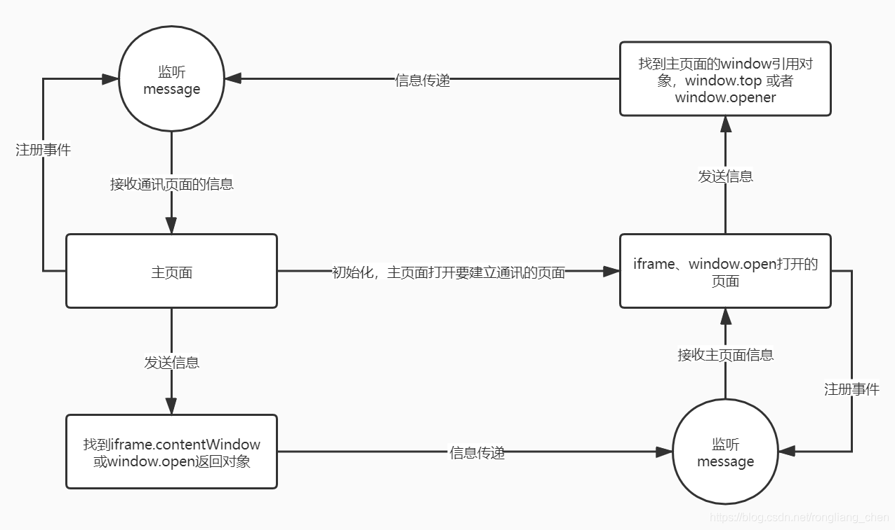

---

# 默认为文件名称
title: 

tags:
  - 跨源通信

# 类别中已包含文件夹名称
categories:

description: postMessage实现多窗口通信，帮助我们进行安全的跨源通信

# 该字段必须,格式 <YYYY-MM-DD hh:mm:ss>
publishTime: 2022-09-10 20:31:10
updateTime:
 
# 默认随机
img: 

# 目录
toc: false

# 评论
comment: true

# 发布
publish: true
---

> 引自：https://juejin.cn/post/7041363060522975246/

使用 window.postMessage 可以帮助我们进行安全的跨源通信。

基本原理是通过 postMessage 来发送跨文档信息，使用 message 来进行监听，当收到跨文档信息后，会触发 message 事件




## 语法

```js
targetWindow.postMessage(message, targetOrigin);
```

**targetWindow**：目标窗口的引用，比如执行 window.open 返回的窗口对象、打开当前窗口的引用window.opener、 iframe 的 contentWindow 属性，或者是命名过或数值索引的 window.frames

**message**：发送给目标 window 的数据

**targetOrigin**：指定接收消息事件的窗口，其值可以是一个 URI 或者字符串 **\***（表示无限制）

> 如果你明确的知道消息应该发送到哪个窗口，那么请始终提供一个有确切值的 targetOrigin ，而不是 *。不提供确切的目标将导致数据泄露到任何对数据感兴趣的恶意站点。

**必须是从 targetOrigin 的 URL 中的某个页面打开的 targetWindow**


## 用法

```js
// A.html
window.addEventListener("message", (e) => {
  console.log(e.data) // 数据
  console.log(e.origin) // 发送消息的文档源，我们可以根据 origin 来确保预期的发送者
  console.log(e.source) // 发送消息的window代理对象
})
// 自动调用open会被浏览器拦截，需要手动取消拦截
// 或者添加一个点击事件，通过手动调用来打开新窗口
window.open("http://127.0.0.1:5501/B.html", "B")

// B.html
const msg = {
  name: "B"
}
const opener = window.opener
opener.postMessage(msg, "http://127.0.0.1:5500")
```


