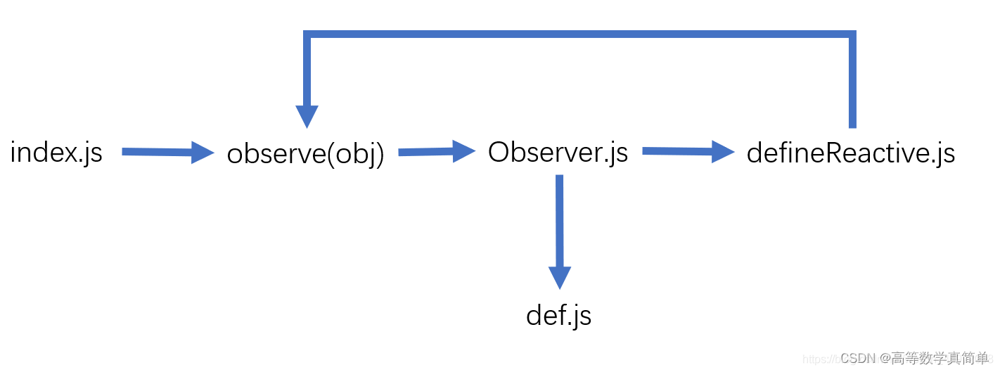
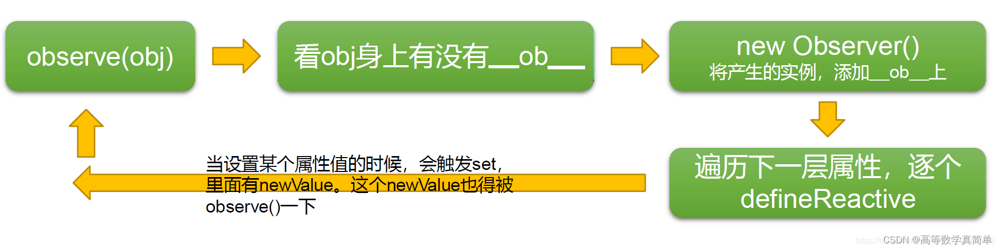

---

# 默认为文件名称
title: 

tags:
  - defineProperty
  - 数据劫持
  - 发布订阅
  - Proxy
  - Reflect

# 类别中已包含文件夹名称
categories:

description: vue2 与 vue3 都是通过怎样的原理实现的响应式呢，他们之间有什么区别？

# 该字段必须,格式 <YYYY-MM-DD hh:mm:ss>
publishTime: 2022-09-06 20:05:06
updateTime: 2022-09-27 20:11:30
 
# 默认随机
img: 

# 目录
toc: true

# 评论
comment: true

# 发布
publish: true

---

# Vue2

> 参考：https://blog.csdn.net/m0_46143427/article/details/124756831

## defineProperty

**`Object.defineProperty()`** 方法会直接在一个对象上定义一个新属性，或者修改一个对象的现有属性，并返回此对象

```js
Object.defineProperty(obj, prop, descriptor)
```

- obj ：要定义属性的对象
- prop：要修改的属性名称或 Symbol (**Symbol**不可被枚举)
- descriptor：要定义或修改的属性描述符

该方法允许精确地**添加或修改**对象的属性。

对于普通的方式，通过**赋值操作**添加的普通属性是**可枚举**的，在枚举对象属性时会被枚举到(**for...in** 或 **Object.keys**方法)，可以**改变这些属性的值**，也可以**删除**这些属性。

```js
const obj = {}
obj.value = 1 // 可枚举，可以被改变和删除
delete obj.value // true
```

而使用此方法添加的属性，默认情况下，是不可修改（immutable）的

```js
const obj = {}
Object.defineProperty(obj, "value", {
  value: 1
})
delete obj.value // false
```

但是可以进行相关的配置，descriptor ：

分为*数据描述符*和*存取描述符*，一个 descriptor 中只能包含一种，不能同时存在两中

都包含的属性：

- configurable：对象的属性是否可以被删除，descriptor 是否可以被修改，默认 false
- enumerable：是否可枚举，出现在 for...in 与 Object.keys 中，默认 false

数据描述符：

- value：该属性对应的值，默认 undefined
- writable：是否可写，默认为 false

存储描述符：

- get：当访问该属性时，会调用此函数，执行时不传入任何参数，但是会传入调用时的 `this` 对象
- set：当属性值被修改时，会调用此函数。该方法接受一个参数（也就是被赋予的新值），会传入赋值时的 `this` 对象。

这里的 `this` 就是调用的这个对象，除非改变 this 指向

|            | configurable | enumerable | value  | writable |  get   |  set   |
| :--------: | :----------: | :--------: | :----: | :------: | :----: | :----: |
| 数据描述符 |     可以     |    可以    |  可以  |   可以   | 不可以 | 不可以 |
| 存取描述符 |     可以     |    可以    | 不可以 |  不可以  |  可以  |  可以  |


## 原理

通过**数据劫持 defineProperty** + **发布订阅者模式**，当 vue 实例初始化后 observer 会针对实例中的 data 中的每一个属性进行劫持并通过 defineProperty() 设置值后在 get() 中向发布者添加该属性的订阅者，这里在编译模板时就会初始化每一属性的 watcher，在数据发生更新后调用 set 时会通知发布者 notify 通知对应的订阅者做出数据更新，同时将新的数据更新到视图上显示。

### 文件关系

八个关键的文件互相调用：

- index.js：入口文件
- observe.js：用于判断某一属性是否为对象或者数组，因为 typeof(array) 返回的也是 object，算是一个局限性。普通数据就直接 return，对象(数组)就给它调用 new Observer
- Observer.js：对传入的属性做类型判断，然后分别转化为可被监测的属性
- def.js：为属性添加 **ob** 属性，做标记，而且可以通过 key.ob 来访问 Observer 的实例
- defineRective.js：给传入的属性做数据劫持(即添加 set/get 方法)，因为是对属性进行操作的,不做类型判断,因此不论这个传入过来的属性是数组还是对象,都会有 get/set 方法
- array.js：该文件将 JS 中能改变数组的 7 个方法重写，并在进行数据劫持的时候将，数组的原型指向该文件加工后的新原型。
- Dep.js：在依赖收集阶段，Dep 对象是 Watcher 对象和 Observer 对象之间纽带，每一个 Observer 都有一个 **Dep** 实例，用来存储订阅者 Watcher
- Watcher.js：当解析到模板字符串 {{ }} 时，会默认去 new Watcher 实例



### 数据劫持

过程：

1. 首先将需要做监听的对象传入 observe 方法内，如果传进去的不是对象(第一次传入的数据毫无疑问是对象，但是后续的子属性还会再次调用 observe 函数，子属性的类型就很复杂了，因此需要有这层判断)，就会直接return。如果是对象(或者数组因为 typeof(array) 返回的也是 object)，就往下走。
2. 此时已经确定了，传入的是个对象(数组)，紧接着会判断这个对象(数组)有没有 **ob** 属性，有则代表已做过监视了，如果没有，就用它 new 一个 Observer 实例。
3. 在new Observer 实例的过程中，会调用 def 方法给该实例添加一个 ob 属性(做个标记)。然后如果是对象则调用 walk 方法，walk 会遍历该对象中的每一项并用 defineReactive 方法加工。如果是数组则修改它的原型(里边有重写好的 API)为 arrayMethods，随即调用 observeArray 方法。
4. defineReactive 方法用于对传入的属性做数据劫持(重写 get/set 方法)。因为是对属性进行操作的，因此即使传入的是数组，它也一定有 get/set 方法。
5. 在 defineReactive 做数据劫持前，仍需再调用一次 observe 方法，去判断当前属性是否还是一个对象，如果是，就会再重复 1-3 的过程。此时这几个文件就形成了递归，直到某一次传入的属性不再是一个对象时，结束递归。当递归结束时，这个对象内的所有属性就都做好了数据劫持。
6. 其中在 defineReactive 中还需要在 set 方法中将获取到的新值再一次使用 observe 方法，变成可监视的，因为这个新值也有可能是对象(或数组)，如果不是，那么就会在 observe.js 文件中中直接 return 了。



对于数组对象来说：

1. 在 array.js 文件中以 Array.prototype 为原型，复制出一个新原型 arrayMethods，再把这个新原型上的 7 个可以改变数组的 API 方法全部重写，分别是：push、pop、shift、unshift、splice、sort、reverse。**这些原始的方法不会触发对象的 set 方法**
2. 这 7 个方法在保留原功能的基础上增加一些数据劫持的代码(也就是将数据变为可监控的)，最后把 arrayMethods 暴露出去
3. 当在 new Observer 时判断传入的数据为数组后，使用 Object.setPrototypeOf() 方法强制让传入的那个数组的原型指向 arrayMthods，这样一来，这个数组以后就会使用我们重写好的 API，就达成响应式的目的。
4. 随后要再一次对数组内的数据进行遍历，因为数组内部，或许还会有对象类型(或者数组类型)的数据。这就相当于用一个拦截器覆盖 Array.prototype，每当使用 Array 原型上的方法操作数组时，先执行 arrayMthods 拦截器中的数据劫持方法，再执行原生 Array 的方法去操作数组。


### 依赖收集

当数据的属性发生变化时，可以通知那些曾经用到的该数据的地方。所以要先收集依赖，把用到这个数据的地方收集起来，等属性改变后，在之前收集好的依赖中循环触发一遍就好了，达到响应式的目的。

针对不同的类型：

- 对象类型：在 getter() 中收集依赖，在 setter() 中触发依赖
- 数组类型：在 getter() 中收集依赖，在 拦截器 中触发依赖

对于某一属性，在数据劫持时它的 Observer 实例上会添加 Dep 实例，Dep 中存储着该数据的所有依赖，Dep.target 表示是否正在依赖收集阶段

此时，数据劫持已完成，Dep.target === true，Vue 解析到模板时遇到指令和数据绑定时都会生成 Watcher 实例，实例中的Watch 属性也会生成 Watcher 实例

过程：

- 在创建 Observer 实例的同时还会创建 Dep 实例，用于保存依赖项。因此每个数据都有 Observer 的实例(key.ob)，每个 Observer 实例中又都有一个 Dep 的实例。
- Vue 解析时，创建 Watcher 实例，在 Watcher 的 constructor 中调用自身的 get 方法，该方法不仅将当前的 Watcher 实例赋值给了 Dep.target(**表示此时处于依赖收集阶段**)，还让这个新实例去读取   数据，一旦读取，就会触发这个数据的 getter 方法。因为此时正在进行收集依赖，Dep.target 一定是为 true 的，于是顺利地把当前的这个 Watcher 实例记录到了 dep 中的 subs 数组里。再然后将 Dep.target 的值重新赋值为 **null**，表示退出依赖收集阶段。
- 为什么能记录到 subs 数组呢？因为在 defineReactive 文件的 17 行新 new 了一个 Dep 实例，这个实例只是一个工具人，通过调用工具人身上的 depend 函数，就将当前时刻的 Watcher 实例添加进去。这样一来当模板解析完毕，dep 实例就掌握这个数据的所有订阅者。
- 当数据的 set 方法被调用时，就执工具人的 dep.notify 方法，他会遍历 dep 实例身上的 subs 数组，这个数组存放了当前数据的所有订阅者，即许多 Watcher 实例，调用每一个 Watcher 实例身上的 update 方法，执行传入过来的回调函数，然后 Vue 接下来通过这个回调函数去进行 diff 算法，对比新旧模板，然后重新渲染页面，至此算是达到了响应式的目的。

## 缺陷

- Vue 是无法检测到对象属性的**添加和删除**(defineProperty的缺陷)，但是可以使用全局 Vue.set 方法(或 vm.$set 实例方法)。
- Vue 无法检测利用索引设置数组，但是可以使用全局 Vue.set方法(或 vm.$set 实例方法)。
- 无法检测直接修改数组长度(length = 1)，但是可以使用 splice。

# vue3

## Proxy

**Proxy** 对象用于创建一个对象的代理，从而实现基本操作的拦截和自定义（如属性查找、赋值、枚举、函数调用等）。

```js
const p = new Proxy(target, handler)
```

- target：要使用 `Proxy` 包装的目标对象（可以是任何类型的对象，包括原生数组，函数，甚至另一个代理）
- handler：一个通常以函数作为属性的对象，各属性中的函数分别定义了在执行各种操作时代理 `p` 的行为

`handler` 对象是一个容纳一批特定属性的占位符对象。它包含有 `Proxy` 的各个捕获器：

1.  `getPrototypeOf(target)`：获取原型
   - 需要返回 对象或者 null
   - 目标对象不可扩展时，返回值需要和原对象一致

2.  `setPrototypeOf(target, prototype)`：设置原型
   - 如果成功修改了`[[Prototype]]`, `setPrototypeOf` 方法返回 `true`,否则返回 `false`.

3.  `isExtensible(target)`：判断对象是否是可扩展的，是否可以添加或删除属性
   - `preventExtensions` (阻止扩展) | `seal`（密封）| `freeze` （冻结）都不可扩展
   - 与原对象返回值一致

4.  `preventExtensions(target)`：阻止扩展
   - 返回 boolean
   - 如果目标对象被操作后还是可扩展的，那么只能返回 `false`

5.  `getOwnPropertyDescriptor(target, propertyKey)`：获取对象一个自由属性对应的属性描述符
   - 返回 对象或者 undefined
   - 当属性存在，且原对象不可扩展或者不可配置，则返回值不能为 undefined
   - 当属性不存在，且原对象不可扩展，则返回值一定为 undefined
   - 返回值可以随便用，是一个新的对象

6.  `defineProperty(target, propertyKey, propertyDescriptor)`：直接在一个对象上定义一个新属性，或者修改一个对象的现有属性，并返回此对象
   - 目标对象不可扩展时不能用这个
   - 不能用这个去覆盖原对象的不可配置的同名属性

7.  `has(target, propertyKey)`：`in` 操作符的捕获器
   - 当属性不可配置或原对象不可扩展时，返回值与原对象一致

8.  `get(target, property)`：读取操作的捕获器
   - 当属性不可写且不可配置时，返回值与原对象一致
   - 当 proxy 没有配置 get 方法时，返回值为 undefined

9.  `set(target, property, value)`：设置操作的捕获器
   - 返回 boolean
   - 当属性不可写且不可配置时，不能改变它的值
   - 当 proxy 没有配置 set 方法时，不能设置它的值

10.  `deleteProperty(target, property)`：`delete`操作的捕获器
    - 返回 boolean
    - 当属性不可配置时，不能被删除

11.  `ownKeys()`：`getOwnPropertyNames` | `getOwnPropertySymbols` 方法的捕获器
    - 返回值必须是 String | Symbol 类型的数组
    - 列表必须包含不可配置的，own 拥有的属性
    - 当原对象不可配置，则列表必须是所有 own 拥有的属性，不能有其他值

12.  `apply(target, thisArg, argumentsList)`：函数调用的捕获器，Function 也是对象，也可以被代理
    - thisArg：被调用时的上下文
    - argumentsList：参数列表
    - target 必须是函数对象

13.   `construct(target, argumentsList, newTarget)`：`new` 操作符的捕获器
    - argumentsList：constructor 的参数列表
    - 必须返回一个对象

### 判断是否为 Proxy

```js
// 修改 Proxy 构造器
Proxy = new Proxy(Proxy, {
  construct(target, argArray) {
    const proxy = new target(...argArray)
    const origin = Object.prototype.toString.call(proxy).slice(8, -1)
    proxy[Symbol.toStringTag] = 'Proxy-' + origin
    return proxy
  }
})
```


## Reflect

Reflect 是一个内置的对象，它提供拦截 JavaScript 操作的方法。这些方法与proxy handlers 的方法相同。Reflect不是一个函数对象，因此它是不可构造的。

与大多数全局对象不同 Reflect 并非一个构造函数，所以不能通过 **new** 运算符对其进行调用，或者将 Reflect 对象作为一个函数来调用。Reflect的所有属性和方法都是静态的（就像 **Math** 对象）

Reflect 对象提供静态方法，这些方法与proxy handler methods 的命名相同

## 响应式

使用 **Proxy** 与 **Reflect** 实现 **reactive**：

```js

class Depend {
  constructor() {
    this.reactiveFns = new Set()
  }
  addDepend(fn) {
    if (fn) {
      this.reactiveFns.add(fn)
    }
  }
  removeDepend(fn) {
    if (fn && this.reactiveFns.has(fn)) {
      this.reactiveFns.delete(fn)
    }
  }
  notify() {
    this.reactiveFns.forEach(fn => fn())
  }

}

let dependFn = null
let handleRemoveDependFn = null
function reactive(obj) {
  return new Proxy(obj, {
    get(target, key) {
      const value = Reflect.get(...arguments)
      const depend = getDepend(target, key)
      depend.addDepend(dependFn)
      handleRemoveDependFn = () => {
        depend.removeDepend()
      }
      return value instanceof Object ? reactive(value) : value
    },
    set(target, key) {
      const depend = getDepend(target, key)
      depend.notify()
      Reflect.set(...arguments)
    }
  })
}

const weakMap = new WeakMap()
function getDepend(target, key) {
  let map = weakMap.get(target)
  if (!map) {
    map = new Map()
    weakMap.set(target, map)
  }
  let depend = map.get(key)
  if (!depend) {
    depend = new Depend()
    map.set(key, depend)
  }
  return depend
}

function watch(fn) {
  dependFn = fn
  fn()
  dependFn = null
  const handleRemove = handleRemoveDependFn
  handleRemoveDependFn = null
  return handleRemove
}


```

对于 vue3，在依赖的收集过程中，创建同一个数据对象的代理，或者代理数据对象的代理，最终保证一处修改在各个地方保持一样的结果。


