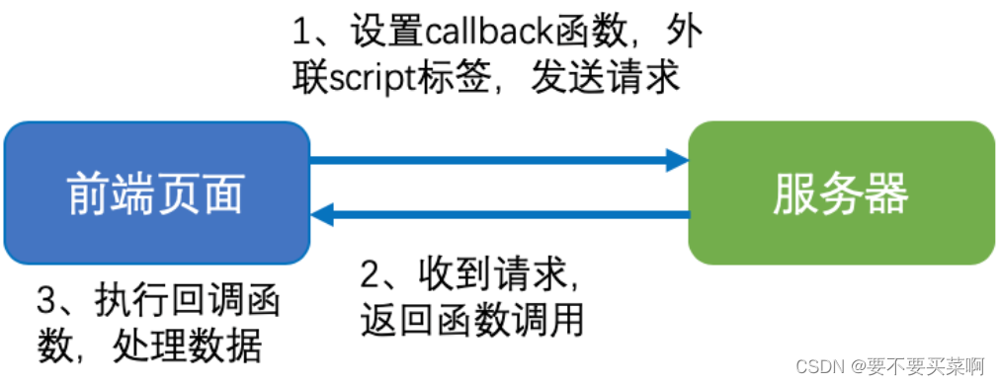
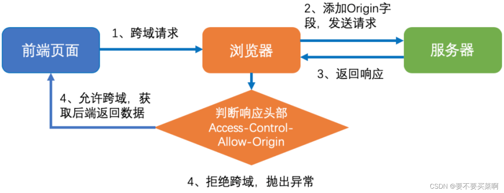

---

# 默认为文件名称
title: 

tags:
  - jsonp
  - cors
  - 简单跨域请求
  - 非简单跨域请求

# 类别中已包含文件夹名称
categories:

description: 由于同源策略的限制，前后端对接时经常会有跨域的问题，怎样解决呢？

# 该字段必须,格式 <YYYY-MM-DD hh:mm:ss>
publishTime: 2022-09-16 17:13:36
updateTime: 2022-09-23 19:53:17

# 默认随机
img: 

# 目录
toc: true

# 评论
comment: true

# 发布
publish: true

---

## 同源策略

### 是什么

同源策略是一个重要的安全策略，它用于限制一个 origin 的文档或它加载的脚本如何能与另一个源的资源进行交互。能够减少恶意文档，减少可能被攻击媒介。 **如果两个URL的协议、域名、端口号都相同，就称这两个URL同源。**

### 为什么

没有同源策略的话：

- cookie、LocalStorage 和 IndexDB 等隐私数据可以被随意获取
- DOM 和 Js对象可以的随意操作
- ajax 可以任意请求

用户的各种隐私肯定会泄露，对用户造成不同程度的损失

### 限制范围

- Cookie、LocalStorage 和 IndexDB 无法读写
- DOM 和 Js对象无法获得
- AJAX请求不能发送(**可以发送，但返回的数据会被浏览器拦截**)

但是，在浏览器中, `script` 、`img`、`iframe`、`link`等标签都可以跨域加载,而不受浏览器的同源策略的限制, 这些带src属性的标签每次加载的时候,实际上都是浏览器发起一次GET请求, 不同于普通请求(XMLHTTPRequest)的是，通过src属性加载的资源,浏览器限制了JavaScript 的权限，使其不能读写 src 加载返回的内容。


## JSONP

jsonp（**JSON with Padding**），是 JSON 的一种 “使用模式”，可以让网页跨域读取数据，其本质是利用 script 标签的开放策略，浏览器传递 callback 参数到后端，后端返回数据时会将 callback 参数作为函数名来包裹数据，从而浏览器就可以跨域请求数据并制定函数来自动处理返回数据。



```js
function jsonpCallback(data) {
  // todo
}

function jsonpReuest(url, callbackName = `jsonpCallback`, query = {}) {
  const script = document.createElement(`script`)
  const searchParams = new URLSearchParams(query)
  searchParams.set('callback', callbackName)
  script.src = `${url}?${searchParams.toString()}`
  document.head.insertAdjacentElement(`afterbegin`, script)
}
```

优点：

- jsonp 兼容性强，适用于所有浏览器，尤其是IE10以下浏览器

缺点：

- 没有关于调用错误的处理
- 只支持 GET 请求，不支持 POST 以及大数据量的请求，也无法拿到相关的返回头，状态码等数据
- callback 参数恶意注入，可能会造成 xss 漏洞
- 无法设置资源访问权限

## CORS

跨域资源共享（**Cross-origin resource sharing，CORS**）是一个 W3C 标准，允许浏览器向跨域服务器发送请求，从而克服了 ajax 只能同源使用的限制。CORS 需要浏览器和服务器同时支持。


### 简单跨域请求

同时满足下面这两个方面：

1. 请求方法是以下三种方法之一：
   - HEAD
   - GET
   - POST
2. HTTP 的头信息不超出以下几种字段：
   - Accept
   - Accept-Language
   - Content-Language
   - Last-Event-ID：服务端消息推送 EventSource 中的后端设置 ID，可以根据它推出之前的状态
   - Content-Type：只限于三个值`application/x-www-form-urlencoded`、`multipart/form-data`、`text/plain`

对于简单请求，浏览器直接发出CORS请求。具体来说，就是在头信息之中，增加一个`Origin`字段，用来说明本次请求来自哪个源（协议+域名+端口）。

如果`Origin`指定的源，不在许可范围内，服务器会返回一个正常的HTTP回应(**服务器都会正常回应的，只是响应被浏览器拦截了**)。浏览器发现，这个回应的头信息没有包含`Access-Control-Allow-Origin`字段如果不包含 Origin ，就知道出错了，从而抛出一个错误，被`XMLHttpRequest`的`onerror`回调函数捕获。注意，**这种错误无法通过状态码识别，因为HTTP回应的状态码有可能是200**。



其中响应头有三个与 CORS 请求相关的字段：

**Access-Control-Allow-Origin**：

该字段是必须的。它的值要么是请求时`Origin`字段的值，要么是一个`*`，表示接受任意域名的请求

**Access-Control-Allow-Credentials**：

该字段可选。它的值是一个布尔值，表示是否允许发送 Cookie。默认情况下，Cookie 不包括在 CORS 请求之中。设为`true`，即表示服务器明确许可，Cookie 可以包含在请求中，一起发给服务器。这个值也只能设为`true`，如果服务器不要浏览器发送Cookie，删除该字段即可。

如果明确需要发送 Cookie，浏览器端也需要设置 `withCredentials = true` 才可，还需要遵循同源策略

**Access-Control-Expose-Headers**：

该字段可选。CORS请求时，`XMLHttpRequest`对象的`getResponseHeader()`方法只能拿到6个基本字段：`Cache-Control`、`Content-Language`、`Content-Type`、`Expires`、`Last-Modified`、`Pragma`。如果想拿到其他字段，就必须在`Access-Control-Expose-Headers`里面指定。


### 非简单跨域请求

非简单请求是那种对服务器有特殊要求的请求，比如请求方法是`PUT`或`DELETE`，或者`Content-Type`字段的类型是`application/json`等

非简单请求的 CORS 请求，会在正式通信之前，增加一次HTTP查询请求，称为"预检"请求（preflight）。"预检"请求用的请求方法是`OPTIONS`，表示这个请求是用来询问的。

预检请求头中除了`Origin`字段，还包括两个特殊字段

**Access-Control-Request-Method**：

该字段是必须的，用来列出浏览器的CORS请求会用到哪些HTTP方法

**Access-Control-Request-Headers**：

该字段是一个逗号分隔的字符串，指定浏览器 CORS 请求会额外发送的头信息字段

<br />

**对于预检的响应**：

**如果成功**，也会包含上述三个 CORS 请求头，里面包括了服务器支持的所有 Method、Headers以及请求的 Origin，这时浏览器才会发出正常的请求

还有另外的请求头：

**Access-Control-Max-Age**：该字段可选，用来指定本次预检请求的有效期，单位为秒，在此期间不用再预检了

**Access-Control-Allow-Credentials**：同简单跨域请求，设置是否允许发送 Cookie


**如果失败**，也会响应为 200，但是不包含任何的 CORS 请求头，浏览器触发 `onerror` 错误回调


优点：

- 支持所有类型的 HTTP 请求，功能完善。
- 通过 onerror 事件监听进行调用错误处理
- 通过 Access-Control-Allow-Origin 进行资源访问授权


## 服务器代理

nginx 配置，因为**服务器与服务器之间没有同源策略**


