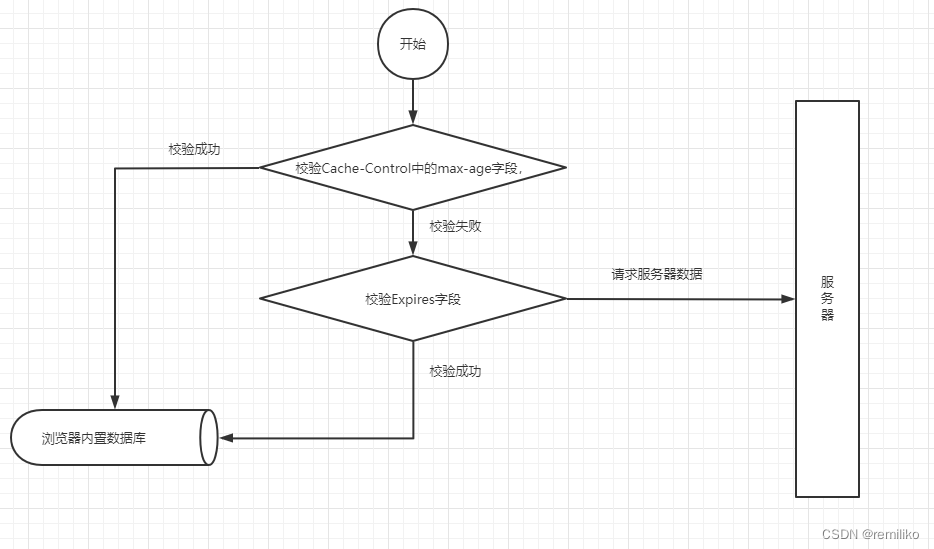
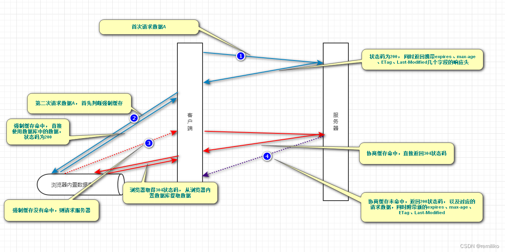

---

# 默认为文件名称
title: 

tags:
  - ETag

# 类别中已包含文件夹名称
categories:

description: 浏览器缓存机制是怎样的呢？什么时候从缓存读取，又什么时候向服务器发送新的请求？

# 该字段必须,格式 <YYYY-MM-DD hh:mm:ss>
publishTime: 2022-09-11 00:49:09
updateTime:
 
# 默认随机
img: 

# 目录
toc: true

# 评论
comment: true

# 发布
publish: true

---

## 强制缓存

强制缓存的思想是，在浏览器内置数据库中缓存每次请求中 “可以被缓存” （受到一些关键字的管控）的静态资源如 image, css, js 文件， 当第二次请求被缓存过的资源时候，会通过校验两个字段 Expires 和 Cache-Control 的max-age字段（注意，**Expires 是 http1.0 的产物， Cache-Control 则是 http1.1 的产物。 两者同时存在， 或者只存在其中之一， 都可以触发强制缓存**）

当满足字段约束的情况下， 浏览器就不会向服务器发送请求而是直接从缓存返回数据， 同时其状态码为 200

当不满足字段约束的情况下， 浏览器则会向服务器正常发送请求

当两个字段同时存在得到时候， **Cache-Control 中的 max-age 字段字段优先级会稍微高一点**， 当 Cache-Control 中的 max-age 字段校验成功，会直接返回浏览器内置数据库的缓存， 失效时才会将决策权传递给 Expires 字段判断。

这样设计的原因，大概是因为 Expires 字段在设计时存在了这么一个缺陷—— **Expires 字段返回的是服务器的时间**， 而非客户端的本机时间。 当存在时差， 或者客户修改本地时间的情况下 Expires 字段会存在失效的可能性

*Cache-Control* 中的 *max-age* 是一个相对值， 即客户端获取到这个文件多少秒后失效， 其判别权力全权交由浏览器， 这会相对更准确些

## 协商缓存

协商缓存主要由 **ETag** 和 **Last-Modified** 两个字段来实现

- ETag：是一个用于映射 web 资源的映射 token，这个 token 应该满足唯一对应到一 个web服务器上的静态资源（具体实现通常是提取文件相关信息进行hash和base64编码等操作）
- Last-Modified：通常是文件最后更新的日期时间戳

浏览器首次向服务器请求数据 A， 服务器正常返回数据，同时在响应头中放入 ETag 和 Last-Modified 两个新字段。

当浏览器第二次向服务器请求数据 A 时， 浏览器会自动地在请求头附上 **If-None-Match** 和 **If-Modified-Since** 两个字段（分别对应的是 **ETag** 和 **Last-Modified** 的值，两两相等）， 然后由服务器端进行校验， 校验通过的话（表明数据有效）， 服务器会直接返回 **状态码 304 ，且不携带响应体的报文段**， 这相当于告诉浏览器：当前缓存有效， 可以直接使用！ 校验失败则会和首次请求一样， 返回**状态码为200且携带数据响应体**的报文段， 同时这个**响应头会带上新的ETag 和Last-Modified**， 为下一次协商缓存做好铺垫 。

## 一起使用

  默认情况下， 浏览器会优先考量强制缓存的情况， 当强制缓存生效的情况下， 请求并不会到达服务器， 因此也就不会触发协商缓存。 当强制缓存失效的时候， 浏览器便会将请求传递到服务器， 于是服务器又会开始校验 If-Modified-Since 和 If-None-math 两个字段， 重复上述协商缓存的一个执行流程

乍一看，两者并存的情况， 有点像是两个协议的简单叠加，此时的**协商缓存更像是强制缓存的兜底策略**， 很可能协商缓存很长一段时间都不会生效（强制缓存过期时间设置过长的情况下）， 因为**强制缓存的优先级是要高于协商缓存**的。 当然这并不是我们想看到的， 比方说当后端数据确实变更了， 而此时的浏览器由于使用了强制缓存，则会出现数据不一致的情况， 因此在这里引入了请求头中的两个字段 **no-cache**， 当使用了 no-cache 字段的时候， 浏览器将不再使用强制缓存， 而是直接去请求服务器， 这个时候就会用到协商缓存了（顺带一提的是， 还有一个 **no-store** 字段， 用了这个字段浏览器则不会在使用缓存的数据也不缓存数据，即强制缓存和协商缓存都失效了）

## 两者区别

1. 强制缓存在缓存有效的情况下不会去请求服务器， 其数据来源则是浏览缓存的本地磁盘。而协商缓存会向服务器请求，但是在协商缓存成功的情况下， 服务器只会返回一个不带响应体的报文
2. 强制缓存在浏览器**强制刷新**的情况下不会生效， 而协商缓存则不受影响
3. 强制缓存返回的报文状态码为 **200**， 协商缓存返回的报文状态码为 **304** （**前端使用fetch请求的情况， 协商缓存的 状态码304 会转成 200**）
4. 强制缓存发生在浏览器端， 协商缓存发生在服务器端

## 使用小结

1. 强制缓存存在一个瓶颈， 当浏览器用户**强制刷新时，浏览器会直接跳过强制缓存**， 这点不注意很容易会被忽视掉。
2. 强制缓存不适合 **SPA** 应用的入口文件， 因为重新部署后， 用户如果没有强制刷新， 则无法在第一时间内看到新的网页内容。
3. 作为一个前端开发者可以通过设置请求头中的 **no-cache** 和 **no-store** 字段选择使用协商缓存或者不使用缓存！！！

